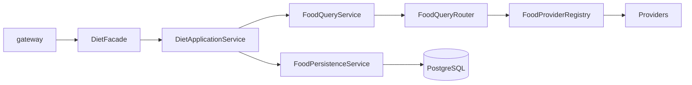

# 饮食中心（Diet Center）

> 模块路径：`apps/biz-service/src/diet/`  
> 运行时归属：**biz-service**（非独立 diet-service 进程）  
> 设计基线：Food Query V4（见 [`docs/food-query-v4.md`](./docs/food-query-v4.md)）

饮食中心负责：**一餐记录**、**食物识别与营养查询**、**用户确认沉淀**、**整餐汇总**。对外经 **gateway → biz-service gRPC（DietFacade）** 暴露。

---

## 1. 一句话架构

```text
CreateMealRecord
  → AnalyzeFoodItem
  → FoodQueryService（统一查询入口）
  → ProviderRouter + ProviderRegistry + Provider
  → NutritionCalculator / Ranking
  → pending meal_item + 快照
  → ConfirmFoodItem
  → FoodPersistenceService（沉淀 foods / user_common）
  → FinishMealRecord
  → MealResult
```

**禁止**：在 `AnalyzeFoodItem` 里直接调第三方 Provider、在 Analyze 阶段写 `user_common_foods`、把 LLM 结果标成 verified。

---

## 2. 主流程与沉淀规则

| 阶段 | 做什么 | 禁止做什么 |
|------|--------|------------|
| **CreateMealRecord** | 创建 `active` 餐次 | — |
| **AnalyzeFoodItem** | 仅走 `FoodQueryService`；创建 `pending` 的 `meal_item`；写入快照 JSON | 不写 `foods` / `user_common_foods`；不累加餐次总热量 |
| **ConfirmFoodItem** | 再走 `FoodQueryService`；`FoodPersistenceService` 沉淀；`meal_item` → `confirmed`；重算餐次总量 | — |
| **FinishMealRecord** | 仅汇总 `confirmed` / `corrected` 条目 | — |



---

## 3. MVP Provider 路由

路由来自 YAML，**不写死在业务代码**：

- 配置：`food-query/config/provider-routes.yaml`
- 加载：`ProviderRouteConfigService`（`PROVIDER_ROUTE_CONFIG_PATH` 可覆盖）

| 市场 | 链路（按顺序，未启用/无 Key 自动跳过） |
|------|----------------------------------------|
| **CN** | vision → internal → boohee → llm_estimate |
| **US** | vision → internal → usda → edamam → llm_estimate |

**未进入 MVP 实时链路**：Open Food Facts、Nutritionix、FatSecret 等（见 V4 文档 §13）。

---

## 4. 目录结构

```text
diet/
├── README.md                          # 本文件
├── diet.module.ts                     # Nest 模块装配
├── diet.facade.ts                     # gateway gRPC 门面（meals.* / foods.suggest）
├── diet.facade.grpc.controller.ts
│
├── meal/                              # 餐次主流程
│   ├── diet-application.service.ts    # Create / Analyze / Confirm / Finish
│   └── diet.service.ts
│
├── food-query/                        # V4 统一查询主干
│   ├── food-query.service.ts          # 唯一查询入口 query()
│   ├── food-query-router.service.ts   # 按 YAML 解析 Provider 链
│   ├── food-provider-registry.ts
│   ├── food-provider-bootstrap.service.ts
│   ├── provider-route-config.service.ts
│   ├── provider-route-config.util.ts
│   ├── food-persistence.service.ts    # 仅 Confirm 沉淀
│   ├── food-query-snapshot.util.ts    # meal_item 快照字段
│   ├── food-query-debug.controller.ts # 本地调试（默认关闭）
│   ├── food-query.types.ts
│   ├── config/provider-routes.yaml
│   └── providers/
│       ├── internal-food.provider.ts
│       ├── llm-estimate-food.provider.ts
│       └── nutrition-data.adapter.ts  # usda / edamam / boohee / vision 适配
│
├── food/                              # 自建库、别名、用户常吃
│   ├── food-knowledge.service.ts
│   ├── food-identity.service.ts
│   └── user-food-profile.service.ts   # 仅统计 confirmed/corrected
│
├── food-analysis/                     # 图片临时 URL、识别日志
│   ├── diet-image-storage.service.ts
│   └── recognition-log.service.ts
│
├── nutrition/                         # 计算器与排序（被 FoodQuery 复用）
│   ├── nutrition-calculator.ts
│   ├── nutrition-ranking.service.ts
│   └── nutrition-localization.util.ts
│
├── providers/                         # 第三方实现（HTTP Client + Provider）
│   ├── boohee/
│   ├── edamam/
│   ├── usda-fdc/
│   ├── vision/                        # openai / gemini / qwen
│   └── estimator/                     # LLM 营养兜底
│
├── interfaces/
│   ├── diet-center.contracts.ts
│   └── provider.contracts.ts
│
└── market/
    └── diet-market.ts                 # CN / US
```

---

## 5. 核心类型

| 类型 | 说明 |
|------|------|
| `FoodQueryInput` | 查询入参（market、inputType、query、imageUrl、weightGram 等） |
| `FoodQueryResult` | 内部完整结果（candidates、routing、recognition、debug.providerTraces） |
| `StandardFoodCandidate` | Provider 统一输出；原始响应只放 `rawPayload` |
| `MealItemResult` | 给用户确认的简化条目（见 V4 文档） |

入口方法：

```ts
FoodQueryService.query(input: FoodQueryInput): Promise<FoodQueryResult>
```

---

## 6. 数据表与快照字段

| 表 | 用途 |
|----|------|
| `meal_records` | 一餐 |
| `meal_items` | 餐内食物；`recognition_status`: pending / confirmed / corrected |
| `foods` / `food_nutrients` | Confirm 后沉淀 |
| `external_food_mappings` | 第三方 ID 映射 |
| `user_common_foods` | 通过 `meal_items` 历史 + Confirm 行为间接维护（`UserFoodProfileService` 只读 confirmed） |
| `food_corrections` | 用户修正记录 |
| `recognition_logs` | 识别/查询全链路日志 |

`meal_items` 快照列（迁移 `20260516120000_meal_items_food_query_snapshots.sql`）：

- `query_snapshot` / `recognition_snapshot` / `result_snapshot`
- `raw_candidates` / `selected_candidate`
- `food_id`（Confirm 后关联）

---

## 7. 对外 API（经 gateway）

由 `DietFacade` 分发，常见 operation：

| Operation | 说明 |
|-----------|------|
| `meals.create` | 创建餐次 |
| `meals.items.analyze` | 分析食物（图片 + 重量） |
| `meals.items.confirm` | 用户确认 |
| `meals.finish` | 结束并汇总 |
| `meals.list` / `meals.get` | 查询 |
| `foods.suggest` | 食物建议 |

gRPC：`DietFacadeGrpcController`（biz.proto）。

---

## 8. 环境变量

```env
# 市场默认
DIET_MARKET=us

# Provider 路由
PROVIDER_ROUTE_CONFIG_PATH=apps/biz-service/src/diet/food-query/config/provider-routes.yaml

# Food Query
FOOD_QUERY_MAX_CANDIDATES=5
FOOD_QUERY_ENABLE_LLM_FALLBACK=false
FOOD_QUERY_ENABLE_NUTRITION_LABEL_OCR=true

# 调试（biz-service HTTP，默认 4030）
FOOD_QUERY_DEBUG_ENABLED=false

# CN
BOOHEE_ENABLED=false

# US
USDA_ENABLED=true
USDA_FDC_API_KEY=
EDAMAM_APP_ID=
EDAMAM_APP_KEY=

# 视觉（Analyze 图片）
LLM_VISION_PROVIDER=openai
OPENAI_API_KEY=
```

缺 Key 时对应 Provider **自动 disabled**，不会导致服务启动失败。

---

## 9. 本地调试

开启 `FOOD_QUERY_DEBUG_ENABLED=true` 后（biz-service 进程）：

```bash
# Provider 状态 + YAML 路由
curl 'http://localhost:4030/debug/providers'

# 文本查询
curl 'http://localhost:4030/debug/food-query/search?q=apple&market=us&tenantId=<tenantId>'
```

未开启时上述路径返回 **404**。

单元测试（在 `api/apps/biz-service` 下）：

```bash
node --import tsx --test src/diet/food-query/*.spec.ts src/diet/nutrition/nutrition.service.spec.ts
```

---

## 10. 扩展新 Provider

1. 在 `providers/<name>/` 实现 HTTP + Mapper（或实现 `FoodNutritionProvider`）
2. 在 `FoodProviderBootstrapService` 注册到 `FoodProviderRegistry`
3. 在 `food-query/config/provider-routes.yaml` 配置市场与 `foodType` 顺序
4. 补充 env 与可选单测

**不要**改 `FoodQueryService` 主流程或 `DietApplicationService` 的 Analyze/Confirm 语义。

---

## 11. 边界（本模块不负责）

- 图片上传 / 对象存储（gateway + base-service storage）
- 用户认证、设备 MQTT、IoT 下行
- 饮食计划 / 每日目标 / 个性化建议（预留 `DietPlanService`）
- Admin 后台 UI（仅有 `callAdmin` 数据接口）

---

## 12. 相关文档

- [docs/food-query-v4.md](./docs/food-query-v4.md) — Food Query V4.0 产品设计 / Codex 开发计划（定版）
- [docs/第三方食品库接入调研.md](./docs/第三方食品库接入调研.md) — 全球化食品库架构与 Provider 选型
- [docs/第三方食品营养识别调研.md](./docs/第三方食品营养识别调研.md) — 阶段一 MVP：CN/US 双链路 Provider 池与调研顺序
- [api/docs/diet-service-food-query-codex-plan-v4.md](../../../docs/diet-service-food-query-codex-plan-v4.md) — 跳转说明（原 `api/docs` 路径）
- [api/AGENTS.md](../../../AGENTS.md) — biz-service 在四服务架构中的位置
