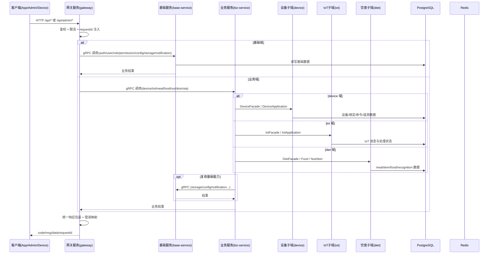
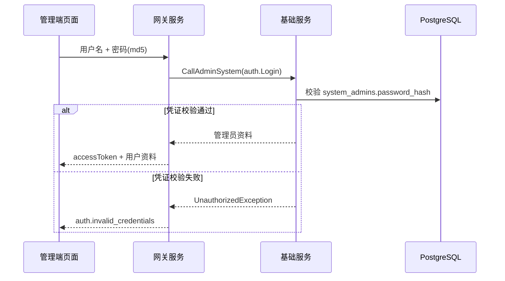
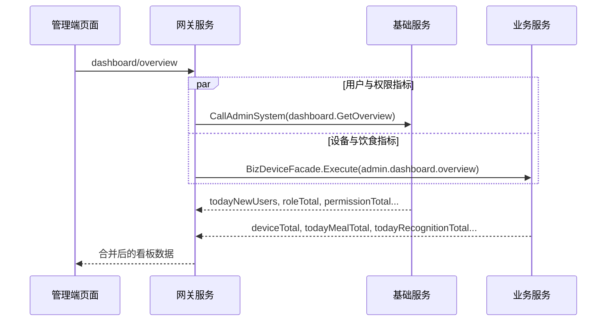
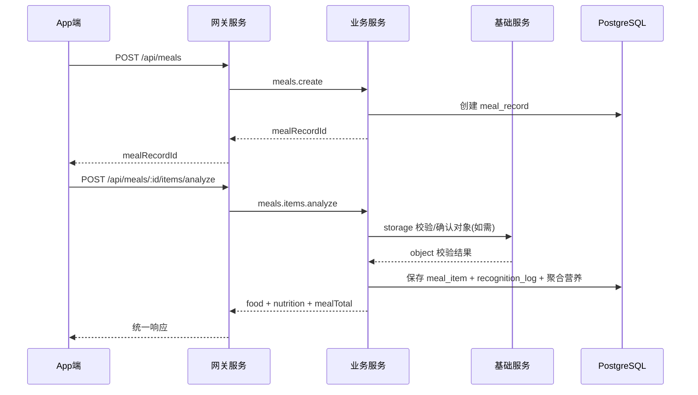
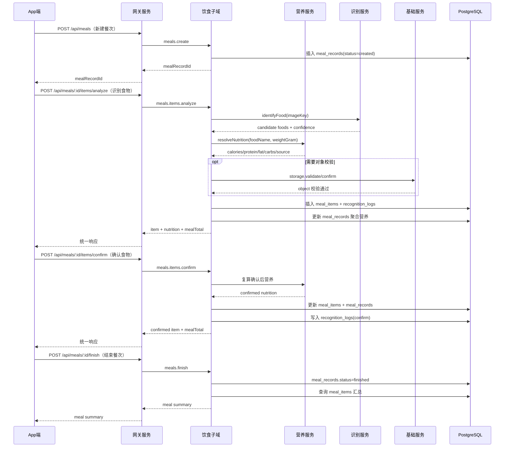
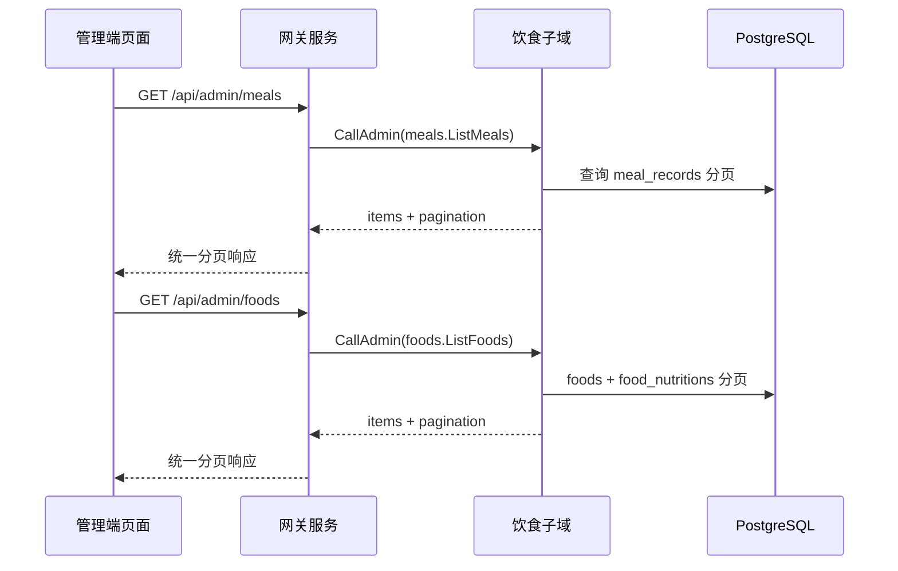
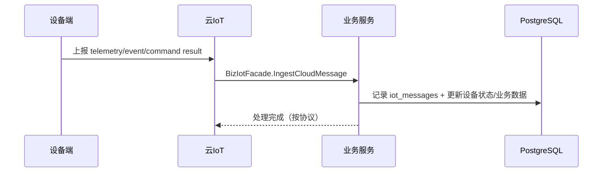
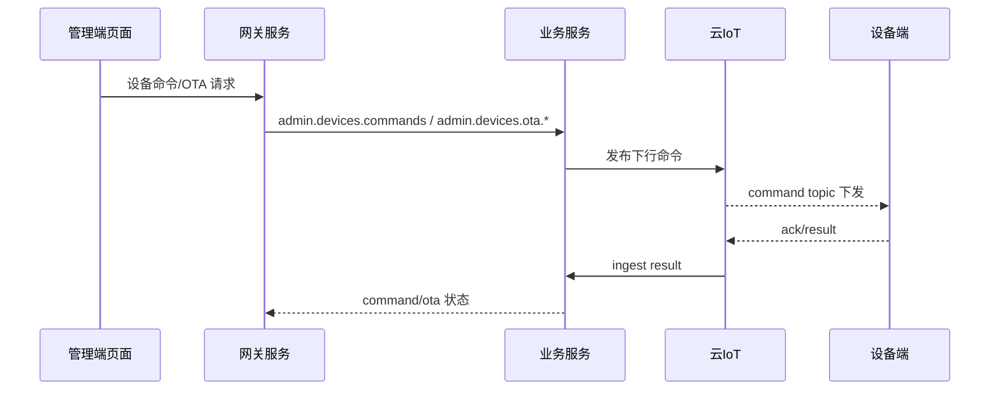

# Lumimax 全栈交互链路设计（MVP 现状）

本文档用于前后端联调与问题排查，描述“从请求进入网关到基础服务/业务服务处理并返回”的关键链路。

## 1. 统一交互总览

## 2. 管理端核心链路

### 2.1 登录链路：`POST /api/admin/auth/login`

### 2.2 看板链路：`GET /api/admin/dashboard/overview`

## 3. 业务服务内部子域拆解（当前实现）

### 3.1 设备子域（device）

- 入口：`BizDeviceFacadeService.Execute`
- 主要 operation（操作名）：
  - C 端：`devices.*`
  - 管理端：`admin.devices.*`、`admin.dashboard.overview`
- 主要数据：`devices`、`device_bindings`、`device_commands`、`device_shadows`

### 3.2 IoT 子域（iot）

- 入口：`BizIotFacadeService.IngestCloudMessage` / `CallAdminMessage`
- 主要 method（方法名）：
  - 管理端：`ListIotMessages`、`GetIotMessage`
- 主要数据：`iot_messages` 及 IoT 事件处理状态

### 3.3 饮食子域（diet：餐食/识别/营养）

- 入口：`BizDietFacadeService.Execute` / `CallAdmin`
- 主要 operation（操作名）：
  - C 端：`meals.create`、`meals.items.analyze`、`meals.items.confirm`、`meals.finish`、`meals.list`、`meals.get`、`foods.suggest`
  - 管理端：`meals.*`、`foods.*`、`recognitionLogs.*`
- 主要数据：`meal_records`、`meal_items`、`foods`、`food_nutritions`、`recognition_logs`

## 4. C 端餐食链路（diet 细化）

### 4.1 新建餐次与识别食物

### 4.2 diet 端到端细化（建餐 -> 识别 -> 确认 -> 完餐）

### 4.3 管理端 diet 查询链路

## 5. 设备与 IoT 链路（MVP）

### 5.1 设备侧上行事件

### 5.2 管理端设备操作下行

## 6. 鉴权与错误处理约定

- 鉴权入口只在 `gateway`（`AuthGuard`、`AdminJwtGuard`、权限守卫）
- 内部服务返回 gRPC 包装错误，gateway 统一映射 HTTP 错误
- 前端统一依赖 `error.key` 判定语义（如 `auth.invalid_credentials`、`user.token_invalid`）
- 所有响应包含 `requestId`，用于端到端日志检索

## 7. 联调建议（按优先级）

1. 先打通 `admin/auth/login` 与 `admin/auth/me`
2. 再验证 `admin/dashboard/overview` 聚合字段完整性
3. 验证 `admin/devices` 与 IoT 消息查询接口
4. 验证 `meals` 主链路：建餐 -> 识别 -> 完餐
5. 最后做异常场景：token 过期、权限不足、上游超时
