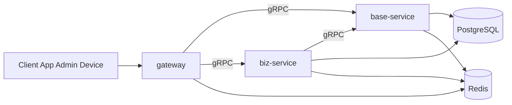
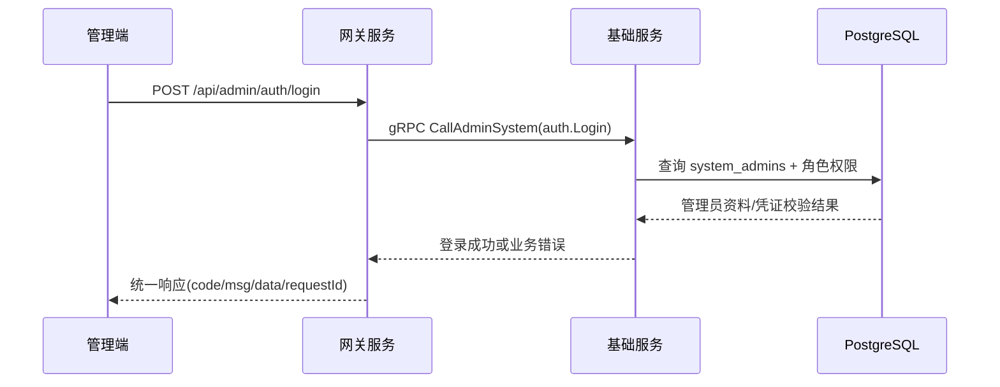
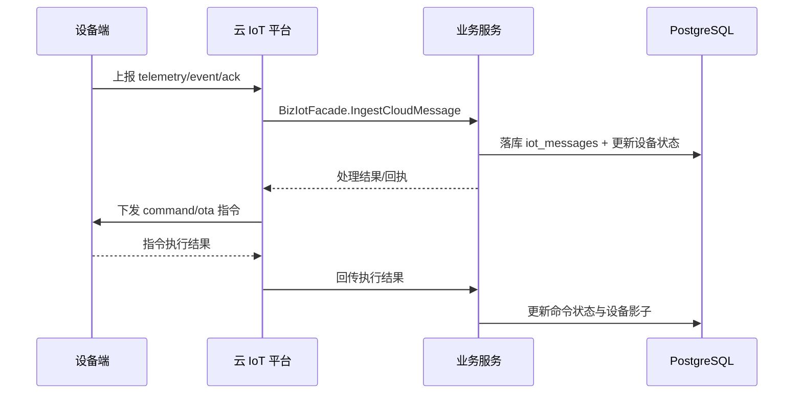
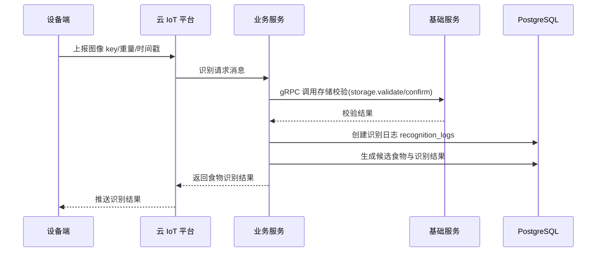
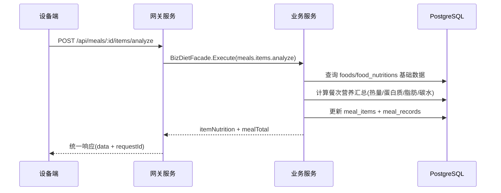
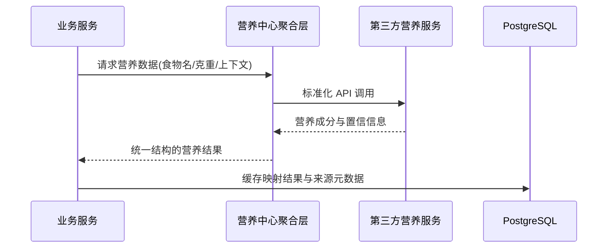

# Lumimax MVP 架构交互图（当前实现）

本文档描述当前代码实现下的三服务 MVP 架构：`gateway`、`base-service`、`biz-service`。

## 1) 服务拓扑图

## 2) 职责边界

- `gateway`
  - 对外唯一入口（HTTP / WebSocket）
  - 鉴权、限流、requestId、统一响应、Swagger 聚合
  - 路由转发与参数聚合，不承载领域核心业务
- `base-service`
  - 认证与账户、角色权限、字典配置、通知、存储、审计日志
  - 提供系统管理 Facade（`BaseSystemFacadeService`）
- `biz-service`
  - 设备、IoT、餐食/识别/营养、实时事件
  - 可按需调用 `base-service`（例如存储校验、基础能力复用）

## 3) MVP 主要业务链路总览

1. B 端用户登录鉴权
2. 设备与 IoT 通讯
3. 设备上报数据并请求食物分析
4. 设备请求餐食营养分析
5. 营养中心第三方对接

---

## 4) B 端用户登录鉴权（`/api/admin/auth/login`）

链路要点：

- 鉴权入口只在 `gateway`，`base-service` 负责账号与权限校验。
- 错误语义统一由 `gateway` 返回，前端基于 `error.key` 处理。

## 5) 设备与 IoT 通讯（设备上行 + 平台下行）

链路要点：

- 设备不直连业务服务，通过云 IoT 平台进行上行与下行。
- `biz-service` 统一承接 IoT 消息解析、落库和业务编排。

## 6) 设备上报数据并请求食物分析（识别链路）

链路要点：

- 识别链路核心在 `biz-service` 的饮食子域（diet）。
- 图片对象与文件合法性由 `base-service` 存储能力兜底校验。

## 7) 设备请求餐食营养分析（营养计算链路）

链路要点：

- 营养分析结果沉淀在 `meal_items` 与 `meal_records`，支持后续确认与完餐。
- 管理端与 App 端可复用同一份聚合营养结果。

## 8) 营养中心第三方对接（外部能力接入）

链路要点：

- 建议在 `biz-service` 内保留“营养中心聚合层”抽象，屏蔽不同第三方差异。
- 对第三方响应做标准化与降级策略（超时、失败回退、本地兜底）。

## 9) 架构约束（必须遵守）

- 客户端只能访问 `gateway`
- `gateway` 只能下游调用 `base-service` / `biz-service`
- `base-service` 不允许反向依赖 `biz-service`
- 业务主键统一为 32 位小写 ULID
- 公共能力优先复用 `libs/common`、`libs/config`、`libs/logger`、`libs/database`、`libs/redis`、`libs/grpc`

