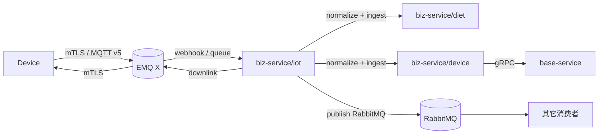
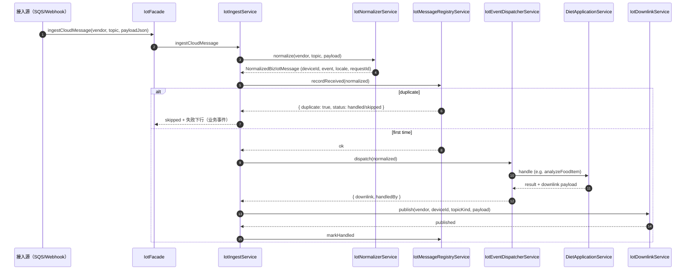
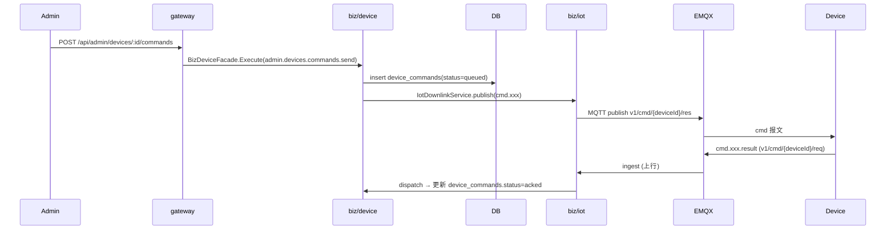

# IoT 通讯模块规范

> 状态：**当前生效**。
> 适用范围：`api/apps/biz-service/src/iot/` 全部代码 + EMQX / 云 IoT broker 接入 + 上下行桥接 + 设备 provisioning。
> 上位约束：[`项目架构总览与开发约束.md`](项目架构总览与开发约束.md)。
> 关联：
> - 设备协议层：[`设备协议模块规范.md`](设备协议模块规范.md)
> - 业务下游：[`饮食中心模块规范.md`](饮食中心模块规范.md)
> - 中等方案技术设计：[`docs/emqx-middle-plan/`](emqx-middle-plan/)
> - 路线图：[`api/docs/分阶段路线图.md`](../api/docs/分阶段路线图.md) §2.2 / §4
> - RabbitMQ 契约：[`api/docs/RabbitMQ消息规范.md`](../api/docs/RabbitMQ消息规范.md)

---

## 1. 模块定位

IoT 通讯模块负责"**设备 ↔ 云**链路上的接入、协议归一化、上下行桥接、消息持久化、错误处理**"。

它**只关心**：

- broker 接入与 mTLS / ACL
- topic 解析 / 校验（v1.3）
- 上行报文从 MQTT → 内部事件（normalize + dispatch）
- 下行报文从内部业务结果 → 设备 topic
- 多 vendor 适配（EMQ X 主线，AWS / 阿里云为预留）
- 消息幂等 / 落库 / 死信
- 设备身份激活（provisioning）

它**不关心**：

- 业务逻辑（饮食 / 营养 / 设备状态聚合）→ 走对应业务 facade
- 设备协议字段定义 → 见《设备协议模块规范》
- 上传凭证签发 → 由 base-service/storage 提供，biz/iot 仅做转发



---

## 2. 当前实现：三个内部域（"module-first"）

> 当前 `api/AGENTS.md` 硬约束仍是 **三个 NestJS 服务**：`gateway / base-service / biz-service`。EMQX 中等方案在 [`docs/emqx-middle-plan/00-master-plan.md`](emqx-middle-plan/00-master-plan.md) §"Recommended Build Interpretation" 已选择 **module-first**：先在 `biz-service` 内拆三个内部域，将来再独立。

| 内部域 | 路径 | 等同未来服务名（仅记号，**不要建工程**） |
| --- | --- | --- |
| `iot-access` | `apps/biz-service/src/iot/` | iot-access-service |
| `device` | `apps/biz-service/src/device/` | device-service |
| `pki`（含证书材料） | `apps/biz-service/src/iot/providers/emqx/`、证书工具 | pki-service |

阶段一：三者都在 `biz-service` 同一进程；按目录强边界 + 内部 service 接口（不要跨目录直接拿 repository）。

---

## 3. 目录结构

```text
api/apps/biz-service/src/iot/
├── iot.module.ts                  # 装配（PersistenceModule + DeviceModule + DietModule）
├── iot.facade.ts                  # 对外执行入口（ingestCloudMessage / callAdminMessage）
├── iot.facade.grpc.controller.ts  # gRPC server（被 gateway 调）
├── iot.types.ts                   # BizIotTopicKind 枚举 + Normalized/Incoming/Downlink 类型
│
├── bridge/                        # 接入桥接层
│   ├── iot.controller.ts            # HTTP webhook 入口（云回调，IOT_RECEIVE_MODE=callback）
│   ├── iot.service.ts               # facade 内部组合
│   ├── iot-application.service.ts   # callAdminMessage 后台查询
│   └── iot-topic.service.ts         # topic 工具（封装 TopicParser）
│
├── events/                        # 协议归一化 + 分发
│   ├── topic-parser.service.ts       # parse / build 4 段 topic
│   ├── iot-normalizer.service.ts     # 把厂商 payload 归一为 NormalizedBizIotMessage
│   ├── iot-envelope.service.ts       # envelope 工厂（下行 meta 装配）
│   ├── iot-message-registry.service.ts  # iot_messages 落库 + 幂等去重
│   ├── iot-ingest.service.ts         # 上行入口：normalize → registry → dispatch → 下行
│   ├── iot-dispatcher.service.ts     # 旧版分发（保留）
│   └── iot-event-dispatcher.service.ts  # 主分发：按 event 路由到 diet/device handler
│
└── providers/                     # 多 vendor 适配
    ├── aws/
    │   ├── aws-iot-sqs.consumer.ts   # AWS IoT → SQS → biz 消费
    │   └── iot-downlink.service.ts   # ⚠️ 三家 vendor 的下行发布都在这（AWS / Aliyun / EMQX）
    ├── emqx/
    │   └── emqx-device-credential.util.ts  # EMQX 客户端证书签发工具
    └── aliyun/                     # 阿里云适配（设计预留，实现弱）
```

> ⚠️ 命名遗留：`providers/aws/iot-downlink.service.ts` 实际上承载了 **AWS / Aliyun / EMQX** 三家下行；不要再新增"通用" downlink service，先把这里的 EMQX 分支彻底完善后再考虑拆。

---

## 4. broker 接入

### 4.1 主线：EMQ X 自建（mTLS）

阶段一硬选项（[`api/docs/分阶段路线图.md`](../api/docs/分阶段路线图.md) §2.2 / §7 决策 4-5）：

- 设备只与 **EMQ X** 交互；公有云 IoT（AWS / 阿里云）为**设计预留 / 容灾**。
- 设备使用 **MQTT v5 over TLS**，**mTLS**（双向证书）认证。
- `clientId = deviceId`，**密码方式禁用**（生产）。

EMQX 强约束：

- Listener `8883` 启用 mTLS：`verify_peer + fail_if_no_peer_cert`。
- `peer_cert_as_username = cn`，`peer_cert_as_clientid = cn`：从证书 CN 解析 deviceId。
- AuthN：HTTP webhook 到 `iot-access-service /internal/mqtt/auth`（详见 [`docs/emqx-middle-plan/03-data-model-api-env-checklist.md`](emqx-middle-plan/03-data-model-api-env-checklist.md) §5.3 / §6.1）。
- AuthZ：HTTP webhook 到 `/internal/mqtt/acl`。
- 上行消息：通过 Rule Engine 或 webhook 投递到 `iot-access-service /internal/mqtt/ingest`。

> 当前代码的对外回调路径在 `bridge/iot.controller.ts` 与 `iot.facade.grpc.controller.ts` 上。EMQX 中等方案要求的 `/internal/mqtt/auth|acl|ingest` 三个回调路径属于**待补全**项；新加路径必须先评审。

### 4.2 预留：AWS IoT Core

- 通过 `IOT_VENDOR=aws` 切换。
- AWS provisioning 流：`CreateThing` / `CreateKeysAndCertificate` / `AttachPolicy` / `AttachThingPrincipal`（见 [`api/README.md`](../api/README.md) §AWS IoT Device Provisioning）。
- 上行：`AwsIotSqsConsumer` 从 SQS 消费 → `IotIngestService.ingestCloudMessage`。
- 下行：`IotDownlinkService.publishToAws` 通过 `@aws-sdk/client-iot-data-plane`。
- **当前不在主部署**，但代码与 schema 必须保持可编译可启动（仅 vendor 切换即可）。

### 4.3 预留：阿里云 IoT

- 通过 `IOT_VENDOR=aliyun` 切换。
- 下行：`IotDownlinkService.publishToAliyun`（HMAC-SHA1 签名 + RPC `Pub`）。
- 设备需要 `productKey`（`devices.product_key`）；缺则跳过下行（warn，不阻塞）。

### 4.4 Topic 命名

当前实现统一使用：

```text
v1/{category}/{deviceId}/{direction}
```

`category ∈ {connect, status, event, attr, cmd}`，`direction ∈ {req, res}`，详见《设备协议模块规范》§4。

`TopicParserService` 是 topic 进出唯一入口；**禁止**在 service 内手拼字符串。

---

## 5. 上行链路（接收 + 归一化 + 分发）

### 5.1 接收模式（二选一）

由 `IOT_RECEIVE_MODE` 控制：

| 模式 | 路径 | 适用 vendor |
| --- | --- | --- |
| `queue`（默认） | 启动后台 consumer（AWS `SqsConsumerService` / EMQX 队列等），调 `IotFacade.ingestCloudMessage` | AWS / EMQX 含队列侧 |
| `callback` | gateway 接 webhook → biz-service `BizIotFacade.IngestCloudMessage` | EMQX 直推 webhook |

### 5.2 主线流程：`IotIngestService.ingestCloudMessage`



要点：

- **每条上行**都通过 `iot_messages` 落库（`messageKey = sha1(requestId + topic)` 唯一约束，做幂等）。
- 重复消息：若上一轮已 `handled / skipped` → 直接复用；若 `failed` → 重跑。
- 失败时**业务事件**会下发失败 `data.code/data.msg`（见 §5.5）；`status.heartbeat` 类生命周期事件**不**下发失败响应。

### 5.3 NormalizedBizIotMessage

```ts
interface NormalizedBizIotMessage {
  vendor: 'aws' | 'aliyun' | 'emqx';
  topic: string;
  deviceId: string;          // lower-case
  topicKind: BizIotTopicKind;
  requestId: string;          // 必须存在；缺失则 normalizer 兜底生成
  event: string;
  locale: string;             // 缺省 DEFAULT_LOCALE
  payload: Record<string, unknown>;
  timestamp: number;
  receivedAt: Date;
}
```

`normalize()` 必须保证：

1. topic 解析合法（4 段、v1、kind 在枚举内）。
2. envelope 必填字段补齐（缺失则用 normalizer 兜底而非抛错）。
3. 厂商差异字段（如阿里云 `topicFullName`、AWS `clientId`）抹平。

### 5.4 分发：`IotEventDispatcherService`

按 `event` 路由到对应业务 handler：

| event | handler |
| --- | --- |
| `connect.register` | `device` 域（设备激活、写 `device.last_seen_at`） |
| `status.heartbeat` | `device` 域（在线态） |
| `upload.token.request` | base-service `storage` 域（通过 gRPC） |
| `meal.record.create` | `diet/meal` 应用层 |
| `food.analysis.request` | `diet/food-analysis` |
| `food.analysis.confirm.request` | `diet/meal` 确认 |
| `nutrition.analysis.request` | `diet/meal` 完餐 |
| `attr.set.result` | `device/commands` |
| `cmd.*.result` | `device/commands` |
| 未知 event | 落库 + 告警；可选返回 `system.error`（暂未启用） |

handler 返回 `BizIotDispatchResult`：

```ts
{ accepted: true, skipped?: boolean, handledBy?: string, data?: {...}, downlink?: BizIotDownlinkMessage }
```

`downlink` 由 dispatcher 决定是否产生（业务请求必产生回执；status / ack 不产生）。

### 5.5 失败下行（自动）

`IotIngestService` 内置失败下行映射（`buildFailureDownlink`），按 reason / error.message 推断错误码：

| 触发 | code | errorCode |
| --- | --- | --- |
| invalid payload / required | 40001 | `invalid_payload` / `*_invalid_request` |
| objectKey invalid | 42200 | (复用上下游 errorCode) |
| meal record not found | 40400 | `meal_record_not_found` |
| meal record already finished | 40910 | `meal_record_already_finished` |
| duplicate request | 40900 | `duplicate_request` |
| 视觉超时 | 50408 | `food_analysis_timeout` |
| 视觉限流 | 42908 | `food_analysis_rate_limited` |
| 视觉鉴权失败 | 50201 | `food_analysis_provider_unauthorized` |
| 视觉不可用 | 50308 | `food_analysis_provider_unavailable` |
| 视觉响应异常 | 50208 | `food_analysis_provider_bad_response` |
| 其它 | 50000 | `*_failed` |

事件覆盖：`upload.token.request / meal.record.create / food.analysis.request / food.analysis.confirm.request / nutrition.analysis.request / connect.register`。其它事件返回 `null`（不下发）。

修改这张表时必须同步：

1. 本文件 §5.5
2. 《[设备协议模块规范](设备协议模块规范.md)》§10.3
3. `api/i18n/errors/*`（如错误对外）
4. 设备固件白名单（与设备团队确认）

---

## 6. 下行链路

### 6.1 入口：`IotDownlinkService.publish`

唯一入口。所有 service 需要向设备发消息时，必须经由：

```ts
iotDownlinkService.publish({
  vendor,
  deviceId,
  topicKind: BizIotTopicKind.EVENT_RES,
  payload: { meta: { requestId, deviceId, timestamp, event, version: '1.0', locale }, data },
  requestId,
  qos: 1,
})
```

行为：

1. `TopicParserService.build()` 拼 topic。
2. `iot_messages` 落库（`direction=downstream`，含 messageKey 幂等约束）。
3. 按 vendor 分发：
   - `aws` → `IoTDataPlaneClient.PublishCommand`
   - `aliyun` → RPC `Pub`（HMAC-SHA1）
   - `emqx` → 临时 MQTT 客户端 `mqtts://{endpoint}:8883` mTLS 发送
4. 返回 `{ topic, requestId, published }`。

### 6.2 EMQX 下行细节

`publishToEmqx`：

- 读 `IOT_ENDPOINT`，未配置时 warn + 跳过（不抛错，避免阻塞业务）。
- 鉴权材料按优先级：
  - `IOT_MQTT_USERNAME / IOT_MQTT_PASSWORD`（弱场景）
  - `IOT_MQTT_CLIENT_CERT_PEM / IOT_MQTT_CLIENT_KEY_PEM`（生产推荐 mTLS）
  - `IOT_ROOT_CA_PEM`（broker 证书校验）
- protocolVersion = 5，clean = true，reconnectPeriod = 0（一次性连接）。
- clientId：`lumimax-biz-{uuid}`（与设备 clientId 隔离）。

### 6.3 命令下发流（含 OTA）



未回执：

- `device_commands` 设 `sent_at`；定时任务 / 延迟队列在 `commandTimeout`（默认 60s）后标 `failed`。
- OTA 三段：`accepted / progress / result`，每段都通过 `IotDownlinkService.publish` 入幂等表。

---

## 7. 设备身份与证书（Provisioning）

### 7.1 当前能力

- 后台 `POST /admin/devices` → biz/device → 落 `devices` + `devices_iot`（云侧绑定信息）。
- 当前**主线**：阶段一以 EMQ X 为主，证书签发优先用 **CA root** 在本地工具签发；中等方案使用 `pki-service` 域抽象。
- AWS provisioning：`AwsIotProvider` 完成 `CreateThing + CreateKeysAndCertificate + AttachPolicy + AttachThingPrincipal`。
- EMQX 客户端证书：`providers/emqx/emqx-device-credential.util.ts` 工具，结合 `IOT_ROOT_CA_PEM / IOT_ROOT_CA_KEY_PEM` 签发；缺 CA 材料时回退自签证书（仅 dev）。

### 7.2 中等方案的证书规则（阶段二目标）

来自 [`docs/emqx-middle-plan/01-protocol-and-topic-contract.md`](emqx-middle-plan/01-protocol-and-topic-contract.md) §3：

- 证书 **CN**：`device:<deviceId>`
- **SAN URI**：`urn:lumimax:device:<deviceId>`
- 单设备最多 1 张 `active` + 1 张 `pending` + 1 张 `grace`。
- 轮换：发新证 → 老证进 `grace`（默认 3 天，`DEVICE_CERT_GRACE_DAYS=3`）→ 设备重连成功后再吊销老证。
- 失败语义（设备侧白名单错误码）：`CERT_IDENTITY_MISMATCH / CERT_KEY_MISMATCH / CERT_EXPIRED / CERT_SWITCH_TIMEOUT / CERT_STORAGE_FAILED`。

### 7.3 当前阶段必须保留的口子

- `devices_iot` 表保留 `provider`（默认 `emqx`，`aws / aliyun` 兼容）。
- 不在前端暴露 AWS 风格 `endpoint / certificateArn / privateKey`；统一返回**一次性下载凭据**或在出厂烧录。
- 当前 admin API `POST /admin/devices` 的外部契约不变；内部从 `ProvisionAwsThing` 切到 EMQX 签发只改实现。

---

## 8. 数据模型

主表（详见 `api/data/db/migrations/20260503100000_init_platform_schema.sql`）：

| 表 | 用途 | 关键字段 |
| --- | --- | --- |
| `devices` | 设备主数据 | `id`、`device_sn`、`tenant_id`、`product_key?`、`market`、`locale`、`firmware_version`、`status`、`provider`、`metadata` |
| `devices_iot` | 云 IoT 绑定信息 | `device_id`、`provider`（aws/aliyun/emqx）、`thing_name?`、`cert_id?`、`region?`、`extras` |
| `device_certificates`（中等方案预留） | 证书生命周期 | `device_id`、`cert_id`、`serial_number`、`thumbprint`、`subject_dn`、`status`、`not_after`、`activated_at`、`revoked_at` |
| `device_bindings` | 用户绑定 | `device_id`、`tenant_id`、`user_id`、`binding_type` |
| `device_commands` | 下行命令记录 | `command_id`、`device_id`、`event`、`payload_json`、`status`、`sent_at`、`acked_at` |
| `iot_messages` | 上下行报文落库 + 幂等 | `id`、`tenant_id`、`message_key`、`device_id`、`direction`（upstream/downstream）、`topic`、`event`、`status`（received/handled/skipped/failed/published）、`payload_json`、`result_json`、`error_json` |
| `recognition_logs` | 识别审计（饮食域，但写入由 IoT 链路触发） | 详见《饮食中心模块规范》§4 |

`messageKey` 唯一约束：

- 上行：`<requestId>:<sha1(topic)[:16]>`（normalize 后给）
- 下行：`<requestId>:<sha1(topic)[:16]>`（downlink service 内构造）

唯一冲突表示重复消息 → 静默忽略（warn 日志）。

---

## 9. 环境变量

来自 `api/README.md` §基础设施配置 + `iot-downlink.service.ts` 实读：

```env
# 通用
IOT_VENDOR=emqx                       # emqx | aws | aliyun（默认 emqx）
IOT_RECEIVE_MODE=queue                # queue（启动 consumer） | callback（gateway webhook）
IOT_QUEUE_URL=...                     # 队列 URL（queue 模式必填）
IOT_PROTOCOL_VERSION=1.0              # 与设备协议 meta.version 解耦的 envelope 版本

# EMQX
IOT_ENDPOINT=emqx-host                # mqtts://host:8883 / 或仅 host（自动补 mqtts:// 8883）
IOT_ROOT_CA_PEM=...                   # 签发设备证书的 CA 公钥
IOT_ROOT_CA_KEY_PEM=...               # 签发设备证书的 CA 私钥（敏感！）
IOT_MQTT_USERNAME=...                 # biz 下行客户端用户名（弱场景）
IOT_MQTT_PASSWORD=...                 # biz 下行客户端密码（敏感）
IOT_MQTT_CLIENT_CERT_PEM=...          # biz 下行 mTLS 客户端证书
IOT_MQTT_CLIENT_KEY_PEM=...           # biz 下行 mTLS 客户端私钥（敏感）

# AWS（兼容）
CLOUD_REGION=ap-southeast-1
CLOUD_ACCESS_KEY_ID=...
CLOUD_ACCESS_KEY_SECRET=...
IOT_POLICY_NAME=lumimax-device-policy
IOT_ENDPOINT=...                      # AWS DescribeEndpoint(iot:Data-ATS)，可省略由代码探测

# 阿里云（预留）
CLOUD_REGION=cn-shanghai
IOT_INSTANCE_ID=...
IOT_PRODUCT_KEY_MAP=...               # 可选 JSON
IOT_MNS_ENDPOINT=...                  # 可选
```

env 读取必须走 `@lumimax/config`（`getEnvString` 等），**严禁** 在 service 里 `process.env.X`。

---

## 10. RabbitMQ 出向（biz 内部事件总线）

[`api/docs/RabbitMQ消息规范.md`](../api/docs/RabbitMQ消息规范.md) §3-§5：

iot 模块出向 routing key（必须维护）：

```text
iot.meal.record.create.v1
iot.food.analysis.request.v1
iot.food.analysis.confirm.request.v1
iot.nutrition.analysis.request.v1
```

设备状态相关（与 base-service notification 对齐，保留兼容）：

```text
device.status / device.telemetry / device.telemetry.reported / device.status.changed
device.command.requested / device.command.ack / device.shadow.synced
```

envelope（外发到 RabbitMQ）：

```json
{
  "meta": {
    "messageId": "01jvq...",
    "requestId": "<原设备 meta.requestId>",
    "event":     "<原 meta.event>",
    "routingKey": "iot.<entity>.<action>.v1",
    "occurredAt": <原 meta.timestamp>,
    "deviceId":  "<原 meta.deviceId>",
    "version":   "1.0",
    "locale":    "<原 meta.locale>"
  },
  "data": { /* 设备 payload.data 原样 */ }
}
```

要求：

- biz/iot 是**唯一** 把 IoT 上行翻译成 RabbitMQ 的位置；其它服务**不要**直接订阅 MQTT。
- 消费侧（biz/diet、biz/device）必须幂等（按 `(deviceId, requestId, event)` 去重，TTL ≥ 24h）。
- 失败重试 1s / 5s / 30s，超出进 `*.dlq`。

---

## 11. 多 vendor 切换规则

未来需要在 EMQX 主线之外开 AWS / Aliyun 时，**只允许**通过 vendor 切换实现：

1. 切 `IOT_VENDOR` env。
2. provider 子目录里加 / 改实现；保持上下行入口（`IotIngestService.ingestCloudMessage` / `IotDownlinkService.publish`）API 不变。
3. **禁止**在业务 service 内分支 `if vendor === 'aws'`；vendor 差异**必须**在 `providers/<vendor>/` 内部消化。
4. 切换上线前必须：
   - 跑 §13 联调清单
   - 验证下行 `iot_messages` 幂等
   - 验证失败下行码映射不变

---

## 12. 错误处理与可观测性

### 12.1 错误处理原则

- ingress 链路上**只**抛 Error / NestJS 业务异常；最终由 `IotIngestService` 统一捕获、归一 failure 下行、写 `iot_messages.error_json`。
- 下行链路上：`publish` 失败抛错（让上层重试 / 走 DLQ），但落库已完成（`status=published`），便于审计。
- 第三方依赖（AWS SDK / mqtt / fetch Aliyun）的错误必须被 `pino` 第三方节流（`LOG_THIRD_PARTY_ERROR_THROTTLE_MS`）覆盖。

### 12.2 必须输出的日志字段

每条 ingress / dispatch / downlink 日志必须包含：

```text
service / context (= "IotIngestService" 等)
requestId / idLabel='ReqId'
deviceId
topic / topicKind
event
locale
handledBy?
downlink?  { topic, event, qos, published, result.code }
errorType / rootCause / shortMessage / hint  (失败时)
```

`requestId` 必须沿用设备上送的同一个值；不要在 biz 侧另起 requestId 覆盖。

### 12.3 指标（最低集）

可暂不接 metrics 系统，但代码必须可观测：

- AuthN allow/deny rate（broker 侧统计）
- ingress TPS / dispatch TPS / downlink success rate
- `iot_messages.status` 分布（received/handled/skipped/failed/published）
- device connect / disconnect 数（通过 broker presence webhook）
- 命令 publish 成功 / 失败 / 超时 数

---

## 13. 联调与回归

### 13.1 接入测试（broker 级）

参考 [`docs/emqx-middle-plan/03-data-model-api-env-checklist.md`](emqx-middle-plan/03-data-model-api-env-checklist.md) §7 Phase 1-2：

- [ ] EMQX 启用 8883 mTLS
- [ ] CA / 服务端证书 / 1 张设备证书生成
- [ ] 设备拿测试证书可连 `8883`
- [ ] 未带证书 / 吊销证书 / 冻结设备**全部**拒绝
- [ ] 设备只能 publish/subscribe 自己的 topic

### 13.2 协议链路（业务级）

```text
1. connect.register → connect.register.result
2. status.heartbeat → status.heartbeat.result
3. upload.token.request → upload.token.result
4. meal.record.create → meal.record.result
5. food.analysis.request → food.analysis.result (items[])
6. food.analysis.confirm.request → food.analysis.confirm.result
7. nutrition.analysis.request → nutrition.analysis.result
8. attr.set → attr.set.result
9. cmd.reboot → cmd.reboot.result
10. cmd.ota.upgrade → accepted → progress → result
```

检查点：

- `iot_messages` 表上下行各一条 + status `handled` / `published`
- 重复 requestId 第二次进 → `status=skipped`
- 强 error（如视觉超时）下行 `code=50408` + `errorCode=food_analysis_timeout`
- 同 requestId 的上下行 `requestId` 全链路串联

### 13.3 回归不可破坏

- topic 解析仍是 4 段 `v1/{cat}/{id}/{dir}`
- `iot_messages.message_key` 唯一约束
- `IotDownlinkService.publish` 入参签名
- 失败下行错误码映射（§5.5 表）
- gateway → biz-service gRPC contract（`BizIotFacadeService.IngestCloudMessage / CallAdminMessage`，见 `api/internal/contracts/proto/biz.proto`）

---

## 14. 路线图（IoT 域）

按 [`docs/emqx-middle-plan/00-master-plan.md`](emqx-middle-plan/00-master-plan.md) §"Execution Shape" 拆 Phase：

| Phase | 内容 | 当前状态 |
| --- | --- | --- |
| A | 协议 & EMQX 接入假设（身份、CN 规则、topic、connect/register） | 部分到位（topic + envelope OK；CN 规则待全量切换） |
| B | `biz-service` 内拆 `device / iot-access / pki` 三个内部域 | 部分到位（`device/` 完整，`iot/` 完整，PKI 工具在 `providers/emqx/`） |
| C | 控制面：device create / cert issue / rotate / EMQX auth+ACL callback | 进行中（EMQX auth/acl 待补） |
| D | 闭环：telemetry / downlink / observability | 主链路 OK；observability 还要补 metrics |

新 PR 在动 IoT 时必须落到具体 Phase，并在 PR 描述里写清"动到 §3 的哪个域 + 与未来服务拆分的兼容性"。

---

## 15. 开发者 checklist（PR 前自检）

- [ ] 未在 gateway / base-service 写 MQTT 解析 / 下行调用
- [ ] 未在 biz/device 或 biz/diet 直接拼 topic（必须 `TopicParserService`）
- [ ] 未引入新 vendor 而未更新 `IotDownlinkService.publish` 与本文件 §11
- [ ] 未跳过 `iot_messages` 落库（每条上行/下行都要落）
- [ ] 未跳过 `IotMessageRegistryService.recordReceived` 幂等检查
- [ ] 修改失败错误码映射（§5.5）已同步《设备协议模块规范》§10.3
- [ ] 新增 RabbitMQ routing key 已登记到 `api/docs/RabbitMQ消息规范.md` §3 + 本文件 §10
- [ ] 任何 EMQX / AWS / Aliyun 凭证读取**走** `@lumimax/config`
- [ ] 任何 broker 配置（CA、AuthN URL）变更已同步 `api/configs/*.env.example`
- [ ] 设备证书签发 / 轮换变更已同步设备团队（CN 规则、文件格式、grace 时长）
- [ ] 测试覆盖：至少一条 happy path + 一条重复请求幂等 + 一条上行错误返回失败下行

---

## 16. 不做清单（IoT 域）

```text
× 让 base-service / biz-service/diet 直接订阅 MQTT topic
× 让客户端 / 设备直连云厂商 IoT API（必须经 gateway → biz/iot）
× 跳过 iot_messages 直接处理（破坏幂等）
× 业务 service 内分支 vendor 字符串（必须收敛到 providers/<vendor>/）
× 同一 deviceId 同时存在多张 active 证书
× 不带 requestId 的下行（违反审计与幂等）
× 在 IoT 模块写营养 / 餐次业务逻辑（必须委托给 diet 域）
× 新增独立 iot-bridge-service / pki-service 部署单元（阶段一硬约束）
× 在 ingest 链路同步阻塞调用第三方 LLM（必须由 diet 内异步控制）
```

---

## 17. 变更登记

| 日期 | 版本 | 变更 |
| --- | --- | --- |
| 2026-05-12 | v1.0 | 整合 v1.3 协议、当前 `biz-service/src/iot/` 实现、EMQX 中等方案 + 多 vendor 适配，沉淀为开发约束 |
