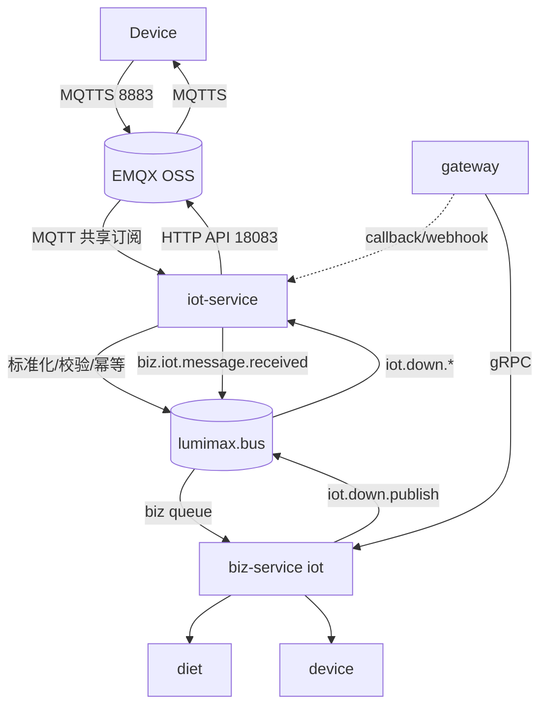
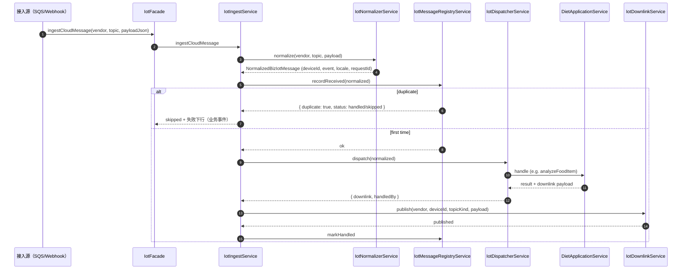
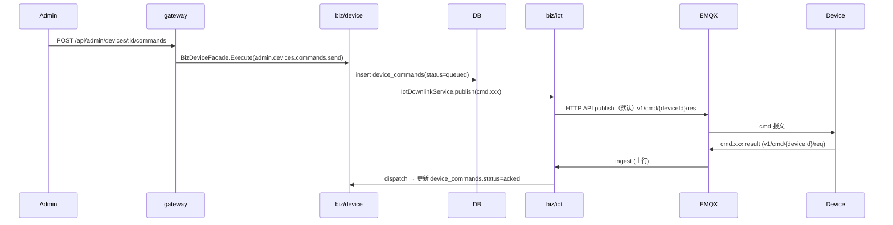

# IoT 通讯模块规范

> 状态：**当前生效**（2026-05-17，**v1.5**：EMQX 开源版 + `iot-service` 负责 EMQX <-> RabbitMQ 桥接）。
> 适用范围：`api/apps/iot-service/`、`api/apps/biz-service/src/iot/`、`api/packages/iot-kit/`；EMQX / AWS broker；RabbitMQ `lumimax.bus`。
> 上位约束：[`项目架构总览与开发约束.md`](项目架构总览与开发约束.md)。
> 关联：
> - 设备协议层：[`设备协议模块规范.md`](设备协议模块规范.md)
> - 业务下游：[`饮食中心模块规范.md`](饮食中心模块规范.md)
> - 自建 EMQX 联调：[`emqx-self-hosted-runbook.md`](emqx-self-hosted-runbook.md)（端口、HTTP API、`http://emqx:18083`）
> - 中等方案技术设计：[`docs/emqx-middle-plan/`](emqx-middle-plan/)
> - 路线图：[`api/docs/分阶段路线图.md`](../api/docs/分阶段路线图.md) §2.2 / §4
> - RabbitMQ 契约：[`api/docs/RabbitMQ消息规范.md`](../api/docs/RabbitMQ消息规范.md)
> - 环境模板：[`api/configs/iot-service.env.example`](../api/configs/iot-service.env.example)、[`api/configs/biz-service.env.example`](../api/configs/biz-service.env.example)

---

## 1. 模块定位

IoT 通讯模块负责"**设备 ↔ 云**链路上的接入、协议归一化、上下行桥接、消息持久化、错误处理**"。

它**只关心**：

- broker 接入与 mTLS / ACL
- topic 解析 / 校验（v1.3）
- 上行报文从 MQTT → 内部事件（normalize + dispatch）
- 下行报文从内部业务结果 → 设备 topic
- 多 vendor 适配（EMQ X 主线，AWS / 阿里云为预留）
- 消息幂等 / 落库 / 死信
- 设备身份激活（provisioning）

它**不关心**：

- 业务逻辑（饮食 / 营养 / 设备状态聚合）→ 走对应业务 facade
- 设备协议字段定义 → 见《设备协议模块规范》
- 上传凭证签发 → 由 base-service/storage 提供，biz/iot 仅做转发



**运行时**：传输与 broker 接入在 **`iot-service`**；业务 ingest / 分发在 **`biz-service`**（`IotModule`）。详见《项目架构总览》§3.4–§3.6。

---

## 2. 服务边界与代码落位

### 2.1 四服务分工（硬约束）

| 服务 | IoT 职责 |
| --- | --- |
| `gateway` | 对外 HTTP；`EMQX_AUTH_SECRET` 校验；`IOT_RECEIVE_MODE=callback` 时 webhook 转发至 **iot-service** gRPC（`IngestCloudMessage`） |
| `iot-service` | EMQX/AWS **ingress**、作为 EMQX MQTT Client 使用**共享订阅**接上行、归一化后发布 `biz.iot.message.received`、消费 `iot.down.publish` 并执行 **EMQX HTTP / MQTT 下行** |
| `biz-service` | 消费 `lumimax.q.biz.events`（`biz.iot.message.received`）；`IotIngestService` → diet/device；下行意图经 `IotDownlinkService` **入队** `iot.down.publish`（不直连 EMQX API） |
| `base-service` | 存储 upload token 等；biz/iot 经 gRPC 调用 |

### 2.2 进程与 RabbitMQ 消费者（当前实现）

| 进程 | `main.ts` 连接的 RMQ queue | 处理的 EventPattern |
| --- | --- | --- |
| `iot-service` | `IOT_RABBITMQ_QUEUE`（默认 `lumimax.q.iot.stream`） | `iot.down.publish` |
| `biz-service` | `RABBITMQ_QUEUE`（默认 `lumimax.q.biz.events`） | `biz.iot.message.received` |

**禁止**在同一进程内为多个 queue 各挂一套会绑定「全量 `@EventPattern`」的 RMQ 微服务；已拆为两个 Node 进程。

启动时 **iot-service** 调用 `ensureIotDeadLetterTopology()` 声明 exchange / 三主队列 / 死信绑定（biz 不再重复 assert）。

### 2.3 共享包

| 路径 | 职责 |
| --- | --- |
| `api/packages/iot-kit/` | EMQX / AWS provider、ingress adapter registry |
| `api/internal/config/` | `IOT_VENDOR`、`IOT_RECEIVE_MODE`、RabbitMQ 拓扑常量 |

`iot-bridge.*` 为 **模块/事件名**，不是运行时服务名。

---

## 3. 目录结构（当前实现）

### 3.1 `iot-service`（传输层）

```text
api/apps/iot-service/src/
├── app.module.ts
├── main.ts                          # gRPC + upstream/downstream RMQ
├── ingress/
│   ├── iot.controller.ts
│   ├── emqx-ingress.service.ts
│   ├── internal-mqtt-auth.service.ts
│   └── aws-iot-sqs.consumer.ts
├── transport/
│   ├── iot-bridge.rabbitmq.ts       # 拓扑 assert、队列名
│   ├── iot-bridge.rabbitmq.controller.ts
│   ├── iot-downstream.rabbitmq.controller.ts
│   ├── iot-bridge.publisher.service.ts
│   ├── iot-downlink.service.ts      # outbox → iot-kit publish
│   └── iot-bridge-rmq.incoming.deserializer.ts
├── pipeline/                        # 归一化后发布 biz.iot.message.received
├── provisioning/
├── grpc/iot-facade.grpc.controller.ts
└── config/iot-service.env.validation.ts
```

### 3.2 `biz-service`（领域 ingest）

```text
api/apps/biz-service/src/
├── iot/                    # IotModule（活跃）
│   ├── iot.module.ts              # 消息 ingest；后续 IoT 消息查询 API 可放此目录
│   ├── transport/
│   │   ├── iot-biz-events.rabbitmq.controller.ts
│   │   ├── iot-bridge.publisher.service.ts
│   │   ├── iot-downlink.service.ts  # 入队下行，非直连 EMQX
│   │   └── iot-bridge.rabbitmq.ts
│   └── pipeline/
│       ├── iot-ingest.service.ts
│       ├── iot-dispatcher.service.ts
│       ├── iot-normalizer.service.ts
│       └── ...
├── device/
│   ├── identity/                    # 经 gRPC 委托 iot-service 签发/轮换证书
│   ├── ports/iot-device-access.port.ts  # ACL 类型（实现与鉴权在 iot-service）
│   └── telemetry/                   # 离线扫描 IOT_DEVICE_OFFLINE_*
└── config/biz-service.env.validation.ts
```

**禁止**在 biz 新增 `ingress/`、upstream/downstream RMQ controller 或直连 EMQX/AWS SDK；传输能力仅在 **iot-service**。

### 3.3 `iot-kit`

```text
api/packages/iot-kit/
├── providers/emqx/emqx-provider.service.ts
├── providers/aws/aws-provider.service.ts
└── registry/iot-provider.registry.ts
```

---

## 4. 消息总线与端到端链路

### 4.1 Exchange 与队列（`lumimax.bus`）

| 资源 | 默认值 | 说明 |
| --- | --- | --- |
| Exchange | `lumimax.bus` | `topic` |
| 业务队列 | `lumimax.q.biz.events` | 绑定 `biz.#` |
| IoT 队列 | `lumimax.q.iot.stream` | `iot.down.#` → **iot-service** consumer |
| 死信 | `lumimax.q.dead` | `dead.#` |

拓扑声明：`iot-service` 启动时 `ensureIotDeadLetterTopology()`（exchange + 三队列 + binding）。

**硬约束**：

- **EMQX 不直接接 RabbitMQ**，不使用 EMQX Enterprise 的内建桥接能力作为主链路。
- 上行由 **`iot-service` MQTT Client 共享订阅**消费 EMQX，再写入 RabbitMQ。
- 下行由 **biz-service -> RabbitMQ -> iot-service -> EMQX publish**，不让 EMQX 直接消费 RabbitMQ。

环境变量分文件配置，见 **§10**；勿使用已废弃的 `IOT_BUS_RUNTIME_ROLE`（按进程固定职责，无 env 开关）。

### 4.2 事件名（稳定契约）

| EventPattern | 方向 | 生产者 | 消费者（目标） |
| --- | --- | --- | --- |
| `biz.iot.message.received` | 归一化业务事件 | bridge 发布 | `biz-service` |
| `iot.down.publish` | 下行任务 | **biz** `IotDownlinkService` 入队 | **iot-service** 消费并发布到云 |

说明：`iot.up.*` 仍可作为内部事件名 / 兼容事件名保留，但在 EMQX 开源版主链路里，**上行源头不是 EMQX -> RabbitMQ**，而是 **EMQX -> iot-service MQTT 共享订阅**。

### 4.3 上行（`IOT_RECEIVE_MODE=mq`）

设备 → EMQX → `iot-service` MQTT 共享订阅 → 标准化 / 校验 / 幂等 → `biz.iot.message.received` → `IotIngestService` → diet/device。

`callback`：EMQX HTTP → gateway `/api/internal/iot/*` → **iot-service** gRPC `IngestCloudMessage` → 同上；**勿**与 mq 双开重复消费。

### 4.4 下行

**biz** `IotDownlinkService` → outbox → `iot.down.publish`（RMQ）→ **iot-service** `IotDownstreamRabbitmqController` → `iot-kit` → **HTTP(S) 云 API / MQTT publish** → EMQX → **MQTTS** → 设备。

- 平台 → 云：EMQX 固定 `POST http://emqx:18083/api/v5/publish`（见 §7.2、runbook）。
- 云 → 设备：**8883 MQTTS**。
- 勿用 RabbitMQ 直连设备；勿让 EMQX 订阅 RabbitMQ 代替应用发布。
- EMQX 开源版主链路默认采用 **应用桥接**，不是 broker 内建消息桥。

下行失败：按 outbox `retryCount` 退避重试（`IotDownstreamRabbitmqController`，退避档 1s…5min）。

### 4.5 部署端口（摘要）

| 谁 | 地址 |
| --- | --- |
| 应用 → EMQX API | `http://emqx:18083` |
| 设备 | `mqtts://<host>:8883` |
| EMQX → gateway | `http://lumimax:80/api/internal/iot/...` |

---

## 5. broker 接入

### 5.1 主线：EMQ X 自建（mTLS）

阶段一硬选项（[`api/docs/分阶段路线图.md`](../api/docs/分阶段路线图.md) §2.2 / §7 决策 4-5）：

- 设备只与 **EMQ X** 交互；公有云 IoT（AWS / 阿里云）为**设计预留 / 容灾**。
- 设备使用 **MQTT v5 over TLS**，**mTLS**（双向证书）认证。
- `clientId = deviceId`，**密码方式禁用**（生产）。

EMQX 强约束：

- Listener `8883` 启用 mTLS：`verify_peer + fail_if_no_peer_cert`。
- `peer_cert_as_username = cn`，`peer_cert_as_clientid = cn`：从证书 CN 解析 deviceId。
- AuthN：HTTP webhook 到 gateway → `/api/internal/iot/mqtt/auth` → **iot-service**（`internal-mqtt-auth.service.ts`）。
- AuthZ：HTTP webhook 到 `/api/internal/iot/mqtt/acl` → **iot-service**。
- 上行消息：**MQTT 共享订阅** → `iot-service`（mq，生产主线）或 webhook → gateway → **iot-service** gRPC（callback，联调 / fallback）。

> 回调经 **gateway** `internal-iot.controller.ts` 转发至 iot-service；勿在 biz-service 重复挂 HTTP ingress。详见 [`emqx-self-hosted-runbook.md`](emqx-self-hosted-runbook.md)。

### 5.2 预留：AWS IoT Core

- 通过 `IOT_VENDOR=aws` 切换。
- AWS provisioning 流：`CreateThing` / `CreateKeysAndCertificate` / `AttachPolicy` / `AttachThingPrincipal`（见 [`api/README.md`](../api/README.md) §AWS IoT Device Provisioning）。
- 上行：**iot-service** `AwsIotSqsConsumer` → 归一化 → `biz.iot.message.received`。
- 下行：**iot-service** 经 `iot-kit` `AwsProviderService` 消费 `iot.down.publish`。
- **当前不在主部署**，但代码与 schema 必须保持可编译可启动（仅 vendor 切换即可）。

### 5.4 Topic 命名

当前实现统一使用：

```text
v1/{category}/{deviceId}/{direction}
```

`category ∈ {connect, status, event, attr, cmd}`，`direction ∈ {req, res}`，详见《设备协议模块规范》§4。

`TopicParserService` 是 topic 进出唯一入口；**禁止**在 service 内手拼字符串。

---

## 6. 上行链路（接收 + 归一化 + 分发）

### 6.1 接收模式（二选一）

由 `IOT_RECEIVE_MODE` 控制：

| 模式 | 路径 | 适用 vendor |
| --- | --- | --- |
| `mq`（推荐生产） | EMQX MQTT 共享订阅 → `iot-service` 归一化 / 去重 / 发布 `biz.iot.message.received`；AWS 走 SQS consumer | EMQX / AWS |
| `callback` | EMQX HTTP → gateway `/api/internal/iot/*` → 同上归一化 | EMQX 联调 |

### 6.2 主线流程：`IotIngestService.ingestCloudMessage`



要点：

- **每条上行**都通过 `iot_messages` 落库（`messageKey = sha1(requestId + topic)` 唯一约束，做幂等）。
- 重复消息：若上一轮已 `handled / skipped` → 直接复用；若 `failed` → 重跑。
- 失败时**业务事件**会下发失败 `data.code/data.msg`（见 §6.5）；`status.heartbeat` 类生命周期事件**不**下发失败响应。

### 6.3 NormalizedBizIotMessage

```ts
interface NormalizedBizIotMessage {
  vendor: 'aws' | 'emqx';
  topic: string;
  deviceId: string;          // lower-case
  topicKind: BizIotTopicKind;
  requestId: string;          // 必须存在；缺失则 normalizer 兜底生成
  event: string;
  locale: string;             // 缺省 DEFAULT_LOCALE
  payload: Record<string, unknown>;
  timestamp: number;
  receivedAt: Date;
}
```

`normalize()` 必须保证：

1. topic 解析合法（4 段、v1、kind 在枚举内）。
2. envelope 必填字段补齐（缺失则用 normalizer 兜底而非抛错）。
3. 厂商差异字段（如阿里云 `topicFullName`、AWS `clientId`）抹平。

### 6.4 分发：`IotDispatcherService`

按 `event` 路由到对应业务 handler：

| event | handler |
| --- | --- |
| `connect.register` | `device` 域（设备激活、写 `device.last_seen_at`） |
| `status.heartbeat` | `device` 域（在线态） |
| `upload.token.request` | base-service `storage` 域（通过 gRPC，强制 `credentials` / STS） |
| `upload.url.request` | base-service `storage` 域（通过 gRPC，强制 `presigned-url`） |
| `meal.record.create` | `diet/meal` 应用层 |
| `food.analysis.request` | `diet/food-analysis` |
| `food.analysis.confirm.request` | `diet/meal` 确认 |
| `nutrition.analysis.request` | `diet/meal` 完餐 |
| `attr.set.result` | `device/commands` |
| `cmd.*.result` | `device/commands` |
| 未知 event | 落库 + 告警；可选返回 `system.error`（暂未启用） |

handler 返回 `BizIotDispatchResult`：

```ts
{ accepted: true, skipped?: boolean, handledBy?: string, data?: {...}, downlink?: BizIotDownlinkMessage }
```

`downlink` 由 dispatcher 决定是否产生（业务请求必产生回执；status / ack 不产生）。

### 6.5 失败下行（自动）

`IotIngestService` 内置失败下行映射（`buildFailureDownlink`），按 reason / error.message 推断错误码：

| 触发 | code | errorCode |
| --- | --- | --- |
| invalid payload / required | 40001 | `invalid_payload` / `*_invalid_request` |
| objectKey invalid | 42200 | (复用上下游 errorCode) |
| meal record not found | 40400 | `meal_record_not_found` |
| meal record already finished | 40910 | `meal_record_already_finished` |
| duplicate request | 40900 | `duplicate_request` |
| 视觉超时 | 50408 | `food_analysis_timeout` |
| 视觉限流 | 42908 | `food_analysis_rate_limited` |
| 视觉鉴权失败 | 50201 | `food_analysis_provider_unauthorized` |
| 视觉不可用 | 50308 | `food_analysis_provider_unavailable` |
| 视觉响应异常 | 50208 | `food_analysis_provider_bad_response` |
| 其它 | 50000 | `*_failed` |

事件覆盖：`upload.token.request / upload.url.request / meal.record.create / food.analysis.request / food.analysis.confirm.request / nutrition.analysis.request / connect.register`。其它事件返回 `null`（不下发）。

修改这张表时必须同步：

1. 本文件 §6.5
2. 《[设备协议模块规范](设备协议模块规范.md)》§10.3
3. `api/i18n/errors/*`（如错误对外）
4. 设备固件白名单（与设备团队确认）

---

## 7. 下行链路

### 7.1 入口：`IotDownlinkService.publish`

唯一入口。所有 service 需要向设备发消息时，必须经由：

```ts
iotDownlinkService.publish({
  vendor,
  deviceId,
  topicKind: BizIotTopicKind.EVENT_RES,
  payload: { meta: { requestId, deviceId, timestamp, event, version: '1.0', locale }, data },
  requestId,
  qos: 1,
})
```

行为：

1. `TopicParserService.build()` 拼 topic。
2. `iot_messages` 落库（`direction=downstream`，含 messageKey 幂等约束）。
3. 按 vendor 分发（**平台 → 云控制面**，统一以 HTTP/HTTPS API 为主）：
   - `aws` → `IoTDataPlaneClient.PublishCommand`（HTTPS）
   - `emqx` → `POST {base}/api/v5/publish`
4. 云侧再通过 **MQTT/MQTTS** 将消息送到设备订阅的 topic。

### 7.1.1 桥接可靠性要求

| 机制 | 必须程度 | 说明 |
| --- | --- | --- |
| MQTT 自动重连 | 必须 | `iot-service` 与 EMQX 断开后必须自动恢复共享订阅 |
| RabbitMQ publisher confirm | 必须 | 上行标准化后写入 RabbitMQ 时，必须确认消息已真正进入 MQ |
| 幂等表 / Redis 去重 | 必须 | 至少按 `deviceId + requestId` 去重；推荐同时落 `iot_messages` |
| DLQ | 必须 | MQ 消费失败进入死信，保留错误摘要 |
| 下行命令状态表 | 推荐 | `queued / published / ack / timeout` |
| ACK 超时扫描 | 推荐 | 设备未回 ACK 时标记超时，必要时触发重发 |
| QoS 1 | 推荐 | 控制、业务确认、OTA 等核心消息使用 |
| 心跳 QoS 0 | 推荐 | 高频低价值心跳 / 在线事件避免压垮链路 |

### 7.2 EMQX 下行细节（`@lumimax/iot-kit` / `EmqxProviderService`）

**默认（硬约束）**：EMQX 下行固定走 HTTP API。

HTTP 模式：

- 请求：`POST {EMQX_HTTP_BASE_URL}/api/v5/publish`（Compose 内推荐 **`http://emqx:18083`**）。
- 鉴权：`IOT_ACCESS_KEY_ID` + `IOT_ACCESS_KEY_SECRET`（Basic）。
- **不要**对 18083 使用 `https://`（EMQX 该口为明文 HTTP）；TLS API 用 **18084** 且 URL 写 `https://emqx:18084`，或开发环境 `EMQX_HTTP_TLS_INSECURE=true`。
- 未配置 `EMQX_HTTP_BASE_URL` 时，可从 `EMQX_BROKER_URL` 推导：若 endpoint 为 MQTTS **8883**，代码会映射为 **`http://…:18083`**（见 `resolveEmqxRestBaseUrl`）。

`EMQX_MQTT_*` / mTLS 材料用于 `iot-service` 作为共享订阅 consumer 连接 EMQX，不再用于平台侧下行发布。

端口与 Compose 联调详见 [`docs/emqx-self-hosted-runbook.md`](emqx-self-hosted-runbook.md) §4.1–§4.2。

### 7.3 命令下发流（含 OTA）



未回执：

- `device_commands` 设 `sent_at`；定时任务 / 延迟队列在 `commandTimeout`（默认 60s）后标 `failed`。
- OTA 三段：`accepted / progress / result`，每段都通过 `IotDownlinkService.publish` 入幂等表。

---

## 8. 设备身份与证书（Provisioning）

### 8.1 当前能力

- 后台 `POST /admin/devices` → biz/device → 落 `devices` + `devices_iot`（云侧绑定信息）。
- 当前**主线**：阶段一以 EMQ X 为主，证书签发优先用 **CA root** 在本地工具签发；中等方案使用 `pki-service` 域抽象。
- AWS provisioning：`AwsIotProvider` 完成 `CreateThing + CreateKeysAndCertificate + AttachPolicy + AttachThingPrincipal`。
- EMQX 客户端证书：`device/identity/device-emqx-certificate.util.ts`（biz），结合 `EMQX_ROOT_CA_PEM / EMQX_ROOT_CA_KEY_PEM` 签发；缺 CA 材料时回退自签证书（仅 dev）。

### 8.2 中等方案的证书规则（阶段二目标）

来自 [`docs/emqx-middle-plan/01-protocol-and-topic-contract.md`](emqx-middle-plan/01-protocol-and-topic-contract.md) §3：

- 证书 **CN**：`device:<deviceId>`
- **SAN URI**：`urn:lumimax:device:<deviceId>`
- 单设备最多 1 张 `active` + 1 张 `pending` + 1 张 `grace`。
- 轮换：发新证 → 老证进 `grace`（默认 3 天，`DEVICE_CERT_GRACE_DAYS=3`）→ 设备重连成功后再吊销老证。
- 失败语义（设备侧白名单错误码）：`CERT_IDENTITY_MISMATCH / CERT_KEY_MISMATCH / CERT_EXPIRED / CERT_SWITCH_TIMEOUT / CERT_STORAGE_FAILED`。

### 8.3 当前阶段必须保留的口子

- `devices_iot` 表保留 `provider`（默认 `emqx`，`aws` 兼容）。
- 不在前端暴露 AWS 风格 `endpoint / certificateArn / privateKey`；统一返回**一次性下载凭据**或在出厂烧录。
- 当前 admin API `POST /admin/devices` 的外部契约不变；内部从 `ProvisionAwsThing` 切到 EMQX 签发只改实现。

---

## 9. 数据模型

主表（详见 `api/data/db/migrations/20260503100000_init_platform_schema.sql`）：

| 表 | 用途 | 关键字段 |
| --- | --- | --- |
| `devices` | 设备主数据 | `id`、`device_sn`、`tenant_id`、`product_key?`、`market`、`locale`、`firmware_version`、`status`、`provider`、`metadata` |
| `devices_iot` | 云 IoT 绑定信息 | `device_id`、`provider`（aws/emqx）、`thing_name?`、`cert_id?`、`region?`、`extras` |
| `device_certificates`（中等方案预留） | 证书生命周期 | `device_id`、`cert_id`、`serial_number`、`thumbprint`、`subject_dn`、`status`、`not_after`、`activated_at`、`revoked_at` |
| `device_bindings` | 用户绑定 | `device_id`、`tenant_id`、`user_id`、`binding_type` |
| `device_commands` | 下行命令记录 | `command_id`、`device_id`、`event`、`payload_json`、`status`、`sent_at`、`acked_at` |
| `iot_messages` | 上下行报文落库 + 幂等 | `id`、`tenant_id`、`message_key`、`device_id`、`direction`（upstream/downstream）、`topic`、`event`、`status`（received/handled/skipped/failed/published）、`payload_json`、`result_json`、`error_json` |
| `recognition_logs` | 识别审计（饮食域，但写入由 IoT 链路触发） | 详见《饮食中心模块规范》§4 |

`messageKey` 唯一约束：

- 上行：`<requestId>:<sha1(topic)[:16]>`（normalize 后给）
- 下行：`<requestId>:<sha1(topic)[:16]>`（downlink service 内构造）

唯一冲突表示重复消息 → 静默忽略（warn 日志）。

---

## 10. 环境变量

配置按服务拆分，模板见：

| 文件 | 进程 |
| --- | --- |
| [`api/configs/shared.env.example`](../api/configs/shared.env.example) | `DB_URL`、`RABBITMQ_URL`、`JWT_SECRET` 等 |
| [`api/configs/iot-service.env.example`](../api/configs/iot-service.env.example) | **传输层** |
| [`api/configs/biz-service.env.example`](../api/configs/biz-service.env.example) | **领域 ingest + 设备证书** |
| [`api/configs/gateway.env.example`](../api/configs/gateway.env.example) | `IOT_SERVICE_GRPC_ENDPOINT`、`EMQX_AUTH_SECRET`（gateway 侧） |
| [`docker/.env.example`](../docker/.env.example) | 单镜像 / Compose 汇总 |

### 10.1 `iot-service`（传输）

```env
IOT_VENDOR=emqx
IOT_RECEIVE_MODE=mq                    # mq | callback（与 gateway 一致）
IOT_RABBITMQ_URL=...                   # 默认可同 RABBITMQ_URL
IOT_RABBITMQ_QUEUE=lumimax.q.iot.stream
# AWS（vendor=aws 且 mq）
AWS_SQS_QUEUE_URL=...
AWS_IOT_ENDPOINT=...
AWS_IOT_POLICY_NAME=...
EMQX_BROKER_URL=mqtts://emqx:8883
EMQX_HTTP_BASE_URL=http://emqx:18083
EMQX_ROOT_CA_PEM=...                   # 设备签发 / API TLS
EMQX_ROOT_CA_KEY_PEM=...
EMQX_AUTH_SECRET=...                   # 与 gateway 一致（internal webhook）
IOT_ACCESS_KEY_ID=... / IOT_ACCESS_KEY_SECRET=...
# AWS IoT 控制面（vendor=aws；与 EMQX HTTP API 共用 IOT_* 凭据名）
IOT_REGION=us-west-2
IOT_ACCESS_KEY_ID=...
IOT_ACCESS_KEY_SECRET=...
AWS_IOT_POLICY_NAME=...
```

完整列表以 `iot-service.env.validation.ts` 为准。`biz-service` 创建设备时经 gRPC `CallAdminMessage` → `ProvisionOnDeviceCreated` 调用 iot-service，**无需**重复配置上述变量。

### 10.2 `biz-service`（领域）

```env
IOT_VENDOR=emqx                         # 与 iot 一致；影响 ingest 路由元数据
IOT_RECEIVE_MODE=mq
IOT_SERVICE_GRPC_ENDPOINT=127.0.0.1:4140  # 设备证书签发 / 轮换 / 删除云身份
RABBITMQ_QUEUE=lumimax.q.biz.events
IOT_RABBITMQ_URL=...
IOT_DEVICE_OFFLINE_TIMEOUT=120
IOT_DEVICE_OFFLINE_INTERVAL=30000
```

**不应**向 biz 注入：`EMQX_*` PEM/HTTP/MQTT、`AWS_SQS_*`、`AWS_IOT_*`、`IOT_*`（均在 **iot-service**）；对象存储 `STORAGE_*` 在 **base-service**。

### 10.3 已废弃 / 移除

| 变量 | 说明 |
| --- | --- |
| `IOT_BUS_RUNTIME_ROLE` | 已删除；iot 固定消费 bridge 队列，biz 固定消费 `RABBITMQ_QUEUE` |
| `LUMIMAX_AUTO_MIGRATE` | 容器入口不再自动 migrate；使用 `pnpm --dir api db:migrate` |

env 读取必须走 `@lumimax/config`（`getEnvString` 等），**严禁** 在 service 里散落 `process.env.X`。

---

## 11. RabbitMQ（桥接 + 业务出向）

[`api/docs/RabbitMQ消息规范.md`](../api/docs/RabbitMQ消息规范.md) §2–§5；IoT 总线硬约束见本文件 **§4**。

### 11.1 IoT bridge EventPattern（`iot-service` / `biz-service` 各自 `transport/iot-bridge.rabbitmq.ts`）

| EventPattern | 说明 |
| --- | --- |
| `iot.up.event` | 云侧上行 payload（兼容事件名；EMQX OSS 主链路由 iot-service 共享订阅产生） |
| `iot.up.lifecycle` | 连接/断开等（兼容事件名） |
| `biz.iot.message.received` | 归一化后交给 biz ingest |
| `iot.down.publish` | 下行发布任务（outbox → provider） |

Routing key 与 EventPattern 同名（topic exchange `lumimax.bus`）。

### 11.2 业务域出向 routing key（必须维护）

```text
iot.meal.record.create.v1
iot.food.analysis.request.v1
iot.food.analysis.confirm.request.v1
iot.nutrition.analysis.request.v1
```

设备状态相关（与 base-service notification 对齐，保留兼容）：

```text
device.status / device.telemetry / device.telemetry.reported / device.status.changed
device.command.requested / device.command.ack / device.shadow.synced
```

envelope（外发到 RabbitMQ）：

```json
{
  "meta": {
    "messageId": "01jvq...",
    "requestId": "<原设备 meta.requestId>",
    "event":     "<原 meta.event>",
    "routingKey": "iot.<entity>.<action>.v1",
    "occurredAt": <原 meta.timestamp>,
    "deviceId":  "<原 meta.deviceId>",
    "version":   "1.0",
    "locale":    "<原 meta.locale>"
  },
  "data": { /* 设备 payload.data 原样 */ }
}
```

要求：

- **桥接**（EMQX MQTT 共享订阅 → `biz.iot.message.received`）归属 transport / 目标 `iot-service`；**业务出向**（下表）由 biz 域发布。
- 其它服务**不要**直接订阅 MQTT。
- 消费侧（biz/diet、biz/device）必须幂等（按 `(deviceId, requestId, event)` 去重，TTL ≥ 24h）。
- 失败重试 1s / 5s / 30s，超出进 `*.dlq`。

---

## 12. 多 vendor 切换规则

未来需要在 EMQX 主线之外开 AWS 时，**只允许**通过 vendor 切换实现：

1. 切 `IOT_VENDOR` env。
2. provider 子目录里加 / 改实现；保持上下行入口（`IotIngestService.ingestCloudMessage` / `IotDownlinkService.publish`）API 不变。
3. **禁止**在业务 service 内分支 `if vendor === 'aws'`；vendor 差异**必须**在 `@lumimax/iot-kit` 的 `providers/<vendor>/` 内部消化。
4. 切换上线前必须：
   - 跑 §14 联调清单
   - 验证下行 `iot_messages` 幂等
   - 验证失败下行码映射不变

---

## 13. 错误处理与可观测性

### 13.1 错误处理原则

- ingress 链路上**只**抛 Error / NestJS 业务异常；最终由 `IotIngestService` 统一捕获、归一 failure 下行、写 `iot_messages.error_json`。
- 下行链路上：`publish` 失败抛错（让上层重试 / 走 DLQ），但落库已完成（`status=published`），便于审计。
- 第三方依赖（AWS SDK / mqtt / fetch）的错误必须被 `pino` 第三方节流（`LOG_THIRD_PARTY_ERROR_THROTTLE_MS`）覆盖。

### 13.2 必须输出的日志字段

每条 ingress / dispatch / downlink 日志必须包含：

```text
service / context (= "IotIngestService" 等)
requestId / idLabel='ReqId'
deviceId
topic / topicKind
event
locale
handledBy?
downlink?  { topic, event, qos, published, result.code }
errorType / rootCause / shortMessage / hint  (失败时)
```

`requestId` 必须沿用设备上送的同一个值；不要在 biz 侧另起 requestId 覆盖。

### 13.3 指标（最低集）

可暂不接 metrics 系统，但代码必须可观测：

- AuthN allow/deny rate（broker 侧统计）
- ingress TPS / dispatch TPS / downlink success rate
- `iot_messages.status` 分布（received/handled/skipped/failed/published）
- device connect / disconnect 数（通过 broker presence webhook）
- 命令 publish 成功 / 失败 / 超时 数

---

## 14. 联调与回归

### 14.1 接入测试（broker 级）

参考 [`docs/emqx-middle-plan/03-data-model-api-env-checklist.md`](emqx-middle-plan/03-data-model-api-env-checklist.md) §7 Phase 1-2：

- [ ] EMQX 启用 8883 mTLS
- [ ] CA / 服务端证书 / 1 张设备证书生成
- [ ] 设备拿测试证书可连 `8883`
- [ ] 未带证书 / 吊销证书 / 冻结设备**全部**拒绝
- [ ] 设备只能 publish/subscribe 自己的 topic

### 14.2 协议链路（业务级）

```text
1. connect.register → connect.register.result
2. status.heartbeat → status.heartbeat.result
3. upload.token.request → upload.token.result
4. upload.url.request → upload.url.result
5. meal.record.create → meal.record.result
6. food.analysis.request → food.analysis.result (items[])
7. food.analysis.confirm.request → food.analysis.confirm.result
8. nutrition.analysis.request → nutrition.analysis.result
9. attr.set → attr.set.result
10. cmd.reboot → cmd.reboot.result
11. cmd.ota.upgrade → accepted → progress → result
```

检查点：

- `iot_messages` 表上下行各一条 + status `handled` / `published`
- 重复 requestId 第二次进 → `status=skipped`
- 强 error（如视觉超时）下行 `code=50408` + `errorCode=food_analysis_timeout`
- 同 requestId 的上下行 `requestId` 全链路串联

### 14.3 回归不可破坏

- topic 解析仍是 4 段 `v1/{cat}/{id}/{dir}`
- `iot_messages.message_key` 唯一约束
- `IotDownlinkService.publish` 入参签名
- 失败下行错误码映射（§6.5 表）
- gateway → biz-service gRPC contract（`BizIotFacadeService.IngestCloudMessage / CallAdminMessage`，见 `api/internal/contracts/proto/biz.proto`）

---

## 15. 路线图（IoT 域）

按 [`docs/emqx-middle-plan/00-master-plan.md`](emqx-middle-plan/00-master-plan.md) §"Execution Shape" 拆 Phase：

| Phase | 内容 | 当前状态 |
| --- | --- | --- |
| A | 协议 & EMQX 接入假设（身份、CN 规则、topic、connect/register） | 部分到位（topic + envelope OK；CN 规则待全量切换） |
| B | `ingress` / `transport` + `iot-kit` → `apps/iot-service`；biz `iot/` ingest | **已落地**：双进程 + 分 queue 消费 |
| C | 控制面：device create / cert issue / rotate / EMQX auth+ACL callback | 进行中（EMQX auth/acl 待补） |
| D | 闭环：telemetry / downlink / observability | 主链路 OK；observability 还要补 metrics |

新 PR 在动 IoT 时必须落到具体 Phase，并在 PR 描述里写清"动到 §3 的哪个域 + 与未来服务拆分的兼容性"。

---

## 16. 开发者 checklist（PR 前自检）

- [ ] 未在 gateway / base-service 写 MQTT 解析 / 下行调用
- [ ] 未在 biz/device 或 biz/diet 直接拼 topic（必须 `TopicParserService`）
- [ ] 未引入新 vendor 而未更新 `IotDownlinkService.publish` 与本文件 §12
- [ ] 未跳过 `iot_messages` 落库（每条上行/下行都要落）
- [ ] 未跳过 `IotMessageRegistryService.recordReceived` 幂等检查
- [ ] 修改失败错误码映射（§6.5）已同步《设备协议模块规范》§10.3
- [ ] 新增 RabbitMQ routing key 已登记到 `api/docs/RabbitMQ消息规范.md` §3 + 本文件 §11
- [ ] 任何 EMQX / AWS 凭证读取**走** `@lumimax/config`
- [ ] 任何 broker 配置（CA、AuthN URL）变更已同步 `api/configs/*.env.example`
- [ ] 设备证书签发 / 轮换变更已同步设备团队（CN 规则、文件格式、grace 时长）
- [ ] 测试覆盖：至少一条 happy path + 一条重复请求幂等 + 一条上行错误返回失败下行

---

## 17. 不做清单（IoT 域）

```text
× 让 base-service / biz-service/diet 直接订阅 MQTT topic
× 让客户端 / 设备直连云厂商 IoT API（必须经 gateway → biz/iot）
× 跳过 iot_messages 直接处理（破坏幂等）
× 业务 service 内分支 vendor 字符串（必须收敛到 `@lumimax/iot-kit` providers/<vendor>/）
× 同一 deviceId 同时存在多张 active 证书
× 不带 requestId 的下行（违反审计与幂等）
× 在 IoT 模块写营养 / 餐次业务逻辑（必须委托给 diet 域）
× 在 biz 进程内承担 EMQX 下行发布 / 多 queue 全量 EventPattern（传输层归属 `iot-service`，见《项目架构总览》§3.4）
× 新增 《项目架构总览》§3.6 所列之外的独立部署单元（如 pki-service）；`iot-service` 为四服务之一，非「额外乱加」
× 在 ingest 链路同步阻塞调用第三方 LLM（必须由 diet 内异步控制）
```

---

## 18. 变更登记

| 日期 | 版本 | 变更 |
| --- | --- | --- |
| 2026-05-12 | v1.0 | 整合 v1.3 协议、当前 `biz-service/src/iot/` 实现、EMQX 中等方案 + 多 vendor 适配，沉淀为开发约束 |
| 2026-05-16 | v1.1 | 对齐四服务边界：传输层 `iot-service`；RabbitMQ 双队列 iot/biz；单镜像 Compose、K8s 可演进 |
| 2026-05-16 | v1.3 | §1–§4 对齐四服务、RMQ 双队列目标、`ingress/transport/pipeline` 目录、端到端 sequence；broker 章顺延为 §5 |
| 2026-05-16 | v1.2 | EMQX 平台下行默认 HTTP API；沉淀端口 8883/18083/18084 与 Compose 内 `http://emqx:18083` 约束 |
| 2026-05-16 | v1.4 | 对齐 `apps/iot-service` + `biz-service/src/iot`；§10 环境变量分文件；移除 `IOT_BUS_RUNTIME_ROLE` 叙述 |
