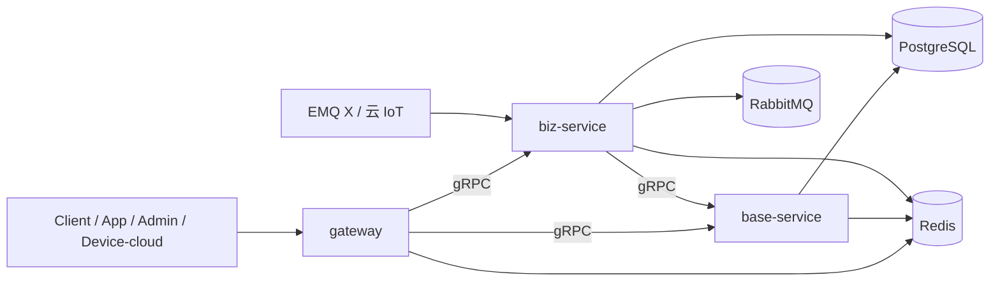

# 项目架构总览与开发约束（Lumimax API）

> 状态：**当前生效**。后续任何开发（人或 Agent）启动前都必须先阅读本文件对齐约束。
> 适用范围：`lumimax/api` monorepo 全量（`gateway` / `base-service` / `biz-service`）。
> 关联文档：
> - 大块功能详细说明：
>   - 饮食中心：[`docs/饮食中心模块规范.md`](饮食中心模块规范.md)
>   - 设备协议：[`docs/设备协议模块规范.md`](设备协议模块规范.md)
>   - IoT 通讯：[`docs/IoT通讯模块规范.md`](IoT通讯模块规范.md)
> - 上游/基线文档：[`api/AGENTS.md`](../api/AGENTS.md)、[`api/docs/分阶段路线图.md`](../api/docs/分阶段路线图.md)、[`api/README.md`](../api/README.md)、[`api/docs/架构交互图.md`](../api/docs/架构交互图.md)、[`api/docs/ERROR_CODES.md`](../api/docs/ERROR_CODES.md)、[`api/docs/RabbitMQ消息规范.md`](../api/docs/RabbitMQ消息规范.md)。
>
> 优先级（冲突时仲裁顺序）：
> **本文件 > 分阶段路线图 > AGENTS.md > Doc-MVP/Doc-Auth/Doc-IoT 飞书文档 > 各专项规范 > 代码注释**。
> 如需偏离，先开评审、改文档、再改代码。

---

## 1. 项目定位

Lumimax 是一套以 IoT 智能营养秤为核心的 **设备 + 饮食识别 + 营养分析** 平台。

- **客户**：北美 + 国内并行上线（区域单部署，互不串数据）。
- **形态**：硬件设备（秤）+ App + 管理后台（admin）+ 官网（web）。
- **本仓库（`api/`）职责**：承载所有后端能力，对外只暴露 `gateway` 一个入口。
- **当前阶段**：MVP（无主用户态 + 设备匿名身份），阶段二补账号体系，长期演进到完整 IoT 平台（不在本期实现）。

---

## 2. 仓库结构

### 2.1 顶层目录

```text
lumimax/                          # 顶层 monorepo（编排层，不做 pnpm install 合并）
├── package.json                  # 顶层编排：转发到 api/ 与 web/ 子项目
├── Makefile                      # make install / dev / docker-build / compose-up ...
├── .gitignore .dockerignore .vscode/
│
├── api/                          # 后端子项目（独立 pnpm workspace，详见 §2.2）
├── web/                          # 前端子项目（独立 pnpm workspace：admin + www）
│
├── docker/                       # 单镜像 lumimax:latest 构建（小团队部署友好）
│   ├── Dockerfile                # 多 stage：api-builder / web-builder / runner
│   ├── nginx.conf                # 80 唯一对外：/, /admin/, /api/, /health
│   ├── supervisord.conf          # 守护 nginx + gateway + base + biz
│   ├── entrypoint.sh
│   └── .env.example
│
├── compose.stack.yml             # 单业务镜像 + postgres/redis/rabbitmq/emqx 一键栈
│
└── docs/                         # 跨端项目级文档（本规范族所在位置）
    ├── 项目架构总览与开发约束.md   # 本文件
    ├── 饮食中心模块规范.md
    ├── 设备协议模块规范.md
    ├── IoT通讯模块规范.md
    ├── diet-service-device-protocol-v1.0.md
    └── emqx-middle-plan/
```

#### 2.1.1 顶层 monorepo 设计取舍（**硬约束**）

- ✅ **顶层负责编排（脚本 + Docker），不做 `pnpm install` 合并**。
- ❌ **禁止把 api/ 与 web/ 的 `pnpm-workspace.yaml` 合到根目录**。两侧 catalog 在 `typescript`（^5.8 vs ^6.0）、`eslint`（^9 vs ^10）、`@types/node`（^22 vs ^25）等版本上有冲突，硬合会触发大量解析问题。
- ✅ **跨端契约真源在后端**：`api/internal/contracts` + `api/docs/ERROR_CODES.md` + `api/i18n/errors/*.json`。若未来需要给前端或其它仓库共享类型/常量，在**独立仓库**发布 npm 包或生成 OpenAPI 客户端后再接入；本 monorepo **不再**内嵌跨端契约镜像目录。

### 2.2 `api/` 目录骨架

```text
api/
├── AGENTS.md                 # Agent 协作硬约束（本文件的下位约束）
├── README.md                 # 本地启动与运维入口
├── package.json / pnpm-workspace.yaml / turbo.json
│
├── apps/                     # 可独立部署的服务（当前只允许三个）
│   ├── gateway/              # 唯一外部入口（HTTP）
│   ├── base-service/         # 基础能力服务（认证/用户/通知/存储/字典/审计...）
│   └── biz-service/          # 核心业务服务（设备/IoT/饮食）
│
├── packages/                 # 跨仓共享的通用能力（无业务）
│   ├── crypto-utils/         # 摘要、HMAC、AES
│   ├── database/             # TypeORM 装配 + DataSource 抽象
│   ├── health/               # 健康检查模板
│   ├── http-kit/             # 统一响应、异常过滤、Swagger、validation
│   ├── logger/               # pino + nestjs-pino 装配
│   ├── mq/                   # RabbitMQ / SQS 消费者底座
│   ├── redis/                # Redis 客户端 + 限流原语
│   ├── runtime/              # request context / trace / ULID
│   ├── storage/              # 对象存储 SDK 抽象
│   └── validation/           # class-validator 包装
│
├── internal/                 # 仅项目内复用的"半通用"能力（含业务上下文）
│   ├── auth/                 # JWT、AuthenticatedUser、guards
│   ├── config/               # env loader、cloud-region 解析
│   ├── contracts/            # gRPC proto（base.proto / biz.proto）+ IoT JSON schemas + 业务错误码
│   ├── integration/          # 服务间集成胶水（gateway grpc 错误包装等）
│   └── security/             # 鉴权策略、tenant scope
│
├── configs/                  # 各环境 env 模板（development/test）
├── data/db/                  # SQL 迁移与 seed（唯一数据库基线）
│   ├── migrations/*.sql
│   └── seeds/*.sql
├── docs/                     # 工程内部文档（团队联调清单、规范、阶段路线图）
├── scripts/                  # db/dev/deploy/smoke 工具脚本
├── i18n/                     # 错误码与文案多语言
├── tools/                    # 一次性工具
└── logs/                     # 本地开发日志输出（.gitignore）
```

### 2.3 重点子目录

`apps/gateway/src/`

```text
main.ts                       # 启动入口
app.module.ts
controllers/                  # controller-context util（不放业务）
dto/
grpc/                         # base/biz 的 gRPC 客户端 + gateway-grpc.module
guards/                       # AuthGuard / Admin guard / RateLimit
rate-limit/                   # Redis 令牌桶
docs/                         # Swagger 聚合页（/docs/hub、/docs/:service）
modules/                      # 各对外业务模块（admin/auth/device/devices/iot/iot-bridge/meals/foods/notification/storage/system/user/users/...）
```

`apps/base-service/src/`

```text
main.ts / app.module.ts
config/                       # 服务级配置
grpc/                         # gRPC server 装配
persistence/                  # TypeORM DataSource + 实体
migrations/                   # 仅服务自身的迁移描述（数据基线见 api/data/db）
modules/
  ├── auth/                   # 用户登录 + 管理员登录 + 隐私请求
  ├── user/                   # C 端用户
  ├── admin/                  # 后台管理（角色/权限/菜单/字典/系统配置...）
  ├── role/ permission/ menu/
  ├── system/ system-config/ dictionary/
  ├── notification/           # 通知中心（落库 + 渠道路由 + 投递记录）
  ├── storage/                # 对象存储（upload token、objectKey 校验）
  ├── audit-log/
  └── shared/
```

`apps/biz-service/src/`

```text
main.ts / app.module.ts
config/ grpc/ persistence/ migrations/ startup/ realtime/
common/                       # tenant-scope util、统一 entity 装配
device/                       # 设备主业务域（详见《设备协议模块规范》）
  ├── devices/                # 设备主数据 CRUD + provisioning
  ├── bindings/               # 设备绑定（阶段一隐式，阶段二多对多）
  ├── commands/               # 设备下行命令
  ├── ota/
  ├── telemetry/
  ├── device.facade.ts        # 对外统一执行入口
  └── device.facade.grpc.controller.ts
diet/                         # 饮食域（详见《饮食中心模块规范》）
  ├── meal/                   # 餐次主链路
  ├── food/                   # 食物身份、知识库、用户常吃
  ├── food-analysis/          # 识别服务 + recognition_log + 图像存储
  ├── nutrition/              # 营养计算 + 路由 + 排序
  ├── providers/              # 第三方 provider 工厂（vision + nutrition + estimator）
  ├── market/                 # 区域常量
  ├── interfaces/             # diet-center.contracts / provider.contracts
  ├── diet.facade.ts
  └── diet.facade.grpc.controller.ts
iot/                          # IoT 通讯域（详见《IoT 通讯模块规范》）
  ├── bridge/                 # iot.controller / iot.service / iot-application.service / iot-topic.service
  ├── events/                 # ingest / normalizer / dispatcher / envelope / topic-parser
  ├── providers/{aws,emqx,aliyun}/  # 多 vendor 适配
  ├── iot.facade.ts
  └── iot.facade.grpc.controller.ts
```

---

## 3. 三服务边界（**硬约束**）



### 3.1 `gateway`（唯一外部入口）

只允许做：

- HTTP 接收（`/api/*`、`/api/admin/*`、`/health`、`/docs/*`）
- 鉴权（`AuthGuard` / `AdminJwtGuard`）、限流（Redis 令牌桶）、CORS、trust proxy
- DTO 校验、参数聚合、路由转发
- 统一响应包装（`code/msg/data/timestamp/requestId` + 分页 + error）
- requestId 注入与回写
- Swagger 聚合（`/docs/hub` / `/docs/:service` / `/docs/openapi/:service`）

**严禁**：

- 在 gateway 写领域业务逻辑（SQL、状态机、跨表事务、营养计算等）。
- 客户端直连 base-service / biz-service。
- 在 gateway 直接调用第三方业务 API（视觉、营养、云 IoT 等）。
- 在 gateway 持久化业务数据（仅允许限流计数等运维态写 Redis）。

### 3.2 `base-service`（基础能力）

承载：`auth / user / role / permission / menu / system-config / dictionary / notification / storage / audit-log`。

**严禁**：

- 反向依赖 biz-service（编译期/运行期/事件订阅都不允许）。
- 持有设备、餐次、营养等业务实体。

### 3.3 `biz-service`（核心业务）

承载：`device / device-binding / iot bridge / meal / food-analysis / nutrition / ota / telemetry / device command`。

可以：

- 通过 gRPC 调用 `base-service` 复用存储、配置、通知等基础能力。
- 消费 RabbitMQ / SQS 接入设备事件。

**严禁**：

- 直接被前端访问（必须经过 gateway）。
- 自行实现"用户/权限/菜单"等基础能力。

### 3.4 不允许新增的服务（**本阶段硬约束**）

不要新增、也不要在 PR 里命名以下服务（即便目录注释里写）：

```text
user-service / device-service / iot-bridge-service / diet-service /
storage-service / notification-service / nutrition-service / pki-service /
realtime-service / weight-service
```

它们的能力都收敛到 `biz-service` 的子域目录（`device/` `diet/` `iot/`）或 `base-service` 内部模块。如未来要拆，按 `internal/contracts/` 中的 gRPC 边界拆。

---

## 4. 通信约定

| 通道 | 方向 | 协议 | 用途 | 备注 |
| --- | --- | --- | --- | --- |
| 外部 | Client → gateway | HTTP / HTTPS | 所有客户端请求 | 唯一对外入口 |
| 内部 | gateway → base/biz | **gRPC**（默认） | 业务转发 | `BASE_SERVICE_GRPC_ENDPOINT` / `BIZ_SERVICE_GRPC_ENDPOINT` |
| 内部 | biz → base | gRPC | 复用基础能力 | 严禁反向 |
| 内部 | 服务 → DB | TypeORM/SQL | 持久化 | `DB_URL` 共享，但通过实体边界隔离 |
| 内部 | 服务 → Redis | ioredis | 限流/缓存/上传 token | `REDIS_URL` 复用，key prefix 隔离 |
| 内部 | 服务 ↔ 总线 | **RabbitMQ topic** | 异步事件 | exchange `app.events` 等；细节见 §6.2 |
| 设备 | Device → EMQ X / 云 IoT | MQTT over TLS（mTLS） | 设备上行 | 见《设备协议模块规范》《IoT 通讯模块规范》 |
| 桥接 | 云 IoT → biz-service | webhook / SQS / RabbitMQ | 上行入队 | `IOT_RECEIVE_MODE=queue\|callback` |

**保留 HTTP 的内部场景**（不准滥用）：

- `/health`、`/docs-json`（仅 Swagger 聚合用）
- 云 IoT 回调（webhook / bridge ingest）

---

## 5. 技术栈与代码规范

### 5.1 运行栈

- **Node.js** 22+
- **pnpm** 10+ workspace（`pnpm-workspace.yaml`）
- **Turbo** 任务编排（`turbo.json`）
- **NestJS** + **TypeScript**
- **TypeORM** + **PostgreSQL 16+**
- **Redis 7+**
- **RabbitMQ 3.13+**
- **gRPC + Protobuf**（`api/internal/contracts/proto/*.proto`）
- 日志：**pino + nestjs-pino**

### 5.2 公共包使用约定

优先使用 `packages/*`，再使用 `internal/*`，再自写：

```ts
import { generateId, generateRequestId } from '@lumimax/runtime';
import { HashUtil } from '@lumimax/crypto-utils';
import { resolveCloudCredentials, resolveCloudRegion, getEnvString } from '@lumimax/config';
import { SqsConsumerService } from '@lumimax/mq';
import { buildGatewayGrpcSuccess, buildGatewayGrpcError } from '@lumimax/integration/grpc/gateway-grpc.util';
```

**严禁**：

- 在业务代码里手撸 UUID/ULID（必须 `generateId()`）。
- 在 service 里直接读 `process.env`，必须走 `@lumimax/config`。
- 在 controller 里直接捕获/吞错（统一响应/过滤器自己处理）。
- 新增重复能力（如再写一套 HTTP 客户端、再写一套日志器）。

### 5.3 ID 与时间

- **业务主键**：32 位小写 **ULID**（`generateId()`，列类型 `varchar(36)`）。
- **requestId**：`x-request-id` 透传；未传时生成 32 位 uuid（`generateRequestId()`）。
- **审计字段**：统一 `creator_id` / `editor_id`，**不要** `created_by` / `updated_by`。
- **时间字段**：`timestamp(3) without time zone`，按 **UTC** 读写；前端按 locale 渲染。
- **设备协议时间戳**：毫秒整数（unix ms）。

### 5.4 命名与目录

- 模块目录：`kebab-case`，文件名 `*.service.ts`、`*.controller.ts`、`*.facade.ts`、`*.module.ts`、`*.entity.ts`。
- 类名 `PascalCase`，方法/字段 `camelCase`。
- 事件名：`<domain>.<entity>.<action>` 全小写点分（如 `device.telemetry.reported`、`food.analysis.request`）。
- 路由：`/api/*`（C 端）+ `/api/admin/*`（B 端），路径全小写连字符。

### 5.5 ESLint / Prettier

- `eslint.config.mjs`、`.prettierrc.json` 已存在，**不要自行覆盖配置**。
- 提交前本地至少跑 `pnpm lint && pnpm typecheck`。

---

## 6. 数据与事件契约

### 6.1 数据库

- 单库多 schema 可接受（暂未启用，物理分库后置）。
- 唯一基线：`api/data/db/migrations/*.sql` + `api/data/db/seeds/*.sql`。
- 应用侧旧 TypeORM 自动迁移已下线，**新增/变更表必须** 写一个新的 SQL migration 文件，禁止改已执行文件。
- 执行入口：`pnpm db:migrate` / `pnpm db:seed`，状态记录在 `public.schema_migrations` / `public.schema_seeds`。
- 当前基线：`20260503100000_init_platform_schema.sql` + `20260503101000_init_platform_seed.sql`。

### 6.2 RabbitMQ 事件总线

详见 [`api/docs/RabbitMQ消息规范.md`](../api/docs/RabbitMQ消息规范.md)。要点：

- **Exchange**：`app.events`（业务通用，topic）、`lumimax.iot.events`、`lumimax.diet.events`、`lumimax.retry.events`。
- **Routing key 格式**：`<domain>.<entity>.<action>.<version>`，如 `iot.food.analysis.request.v1`。
- **MVP 必须支持的 routing keys**（保留兼容）：

  ```text
  audit.admin.action
  device.telemetry / device.status / device.telemetry.reported / device.status.changed
  device.command.requested / device.command.ack / device.shadow.synced
  storage.upload.token.requested / storage.upload.token.issued
  iot.meal.record.create.v1
  iot.food.analysis.request.v1
  iot.food.analysis.confirm.request.v1
  iot.nutrition.analysis.request.v1
  ```

- **统一 envelope**：

  ```json
  {
    "eventId": "01HZX...",
    "eventName": "xxx",
    "occurredAt": "2026-04-22T06:00:00.000Z",
    "source": "biz-service",
    "data": { },
    "requestId": "uuid32xxx"
  }
  ```

- **重试与死信**：最多 3 次（1s/5s/30s 指数退避），超出进 `*.dlq`，DLQ 必须保留最后错误原因 + stack 摘要。

### 6.3 统一响应协议

成功：

```json
{ "code": 0, "msg": "ok", "data": {}, "timestamp": 1710000000000, "requestId": "..." }
```

分页：在外层加 `pagination: { page, pageSize, total, totalPages, hasMore }`。

错误：

```json
{
  "code": 40001,
  "msg": "未授权，请先登录",
  "data": null,
  "timestamp": 1710000000000,
  "requestId": "...",
  "error": { "key": "user.noauth", "locale": "zh-CN", "rawMessage": "...", "details": {} }
}
```

错误码与 `error.key` 见 [`api/docs/ERROR_CODES.md`](../api/docs/ERROR_CODES.md)。前端只能依赖 `error.key`，不依赖 `msg`。

NestJS 异常 → HTTP/业务码映射（必须保持）：

| Exception | code |
| --- | --- |
| BadRequestException | 40000 / 40003 / 40004 |
| UnauthorizedException | 40100 / 40001 / 40002 / 40101 |
| ForbiddenException | 40300 / 40301 / 40302 |
| NotFoundException | 40400 / 40401 / 40402 |
| ConflictException | 40900 / 40901 |
| UnprocessableEntityException | 42200 / 42201 |
| 429 限流 | 42901 |
| 5xx / 未知 | 50000 / 50301 / 50401 |

### 6.4 多语言

- 请求头：优先 `x-lang`，其次 `x-locale`，最后 `accept-language`。
- 命中 `zh*` → `zh-CN`；命中 `ko*/kr*` → `ko-KR`；其余 → `en-US`。
- 错误文案：`api/i18n/errors/{zh-CN,en-US,ko-KR}.json`。
- 设备协议在 `meta.locale` 透传，下行第三方调用时也透传。
- 服务端默认语言：`DEFAULT_LOCALE`（默认 `en-US`）；默认业务市场：`DEFAULT_MARKET`。

---

## 7. 鉴权与权限

- **JWT** 签发：`base-service auth` 模块；秘钥 `JWT_SECRET`。
- **C 端**：`/auth/user/login`，payload 含 `userId` / `type=user`。
- **B 端**：`/auth/admin/login`，payload 含 `userId` / `type` / `tenantId` / `roles` / `policies` / `permissions`。
- **守卫链路**：
  - C 端业务：gateway `AuthGuard`
  - B 端业务：gateway `AdminJwtGuard` + `InternalPrincipalGuard` + `PolicyGuard`（含 tenant scope）。
- **客户端权限语义**：必须基于 `error.key`，不要基于状态码做硬判（同一个 401 可能是 `auth.invalid_credentials` 也可能是 `user.token_invalid`）。
- 第三方登录（`google/wechat`）当前为预留入口，未实现的接口**不要假装实现**。

---

## 8. 存储与对象路径

详见 [`api/README.md`](../api/README.md) §Storage 路径规范 / 上传令牌。要点：

- **objectKey 不包含 provider、tenantId**，provider 仅写 metadata 与 DB 字段。
- 临时路径：
  - 绑定用户：`tmp-file/user/{userId}/{filename}`
  - 未绑定用户：`tmp-file/device/{deviceId}/{filename}`
- 用户头像：`file/user/{userId}/avatar/image/{filename}`
- 用户业务文件：`file/user/{userId}/{bizType}/{bizId}/{mediaType}/{filename}`
- 设备业务文件：`file/device/{deviceId}/{bizType}/{bizId}/{mediaType}/{filename}`
- 临时上传令牌：Redis key `storage:upload-token:{tokenId}`，tokenId `ut_{ULID}`；上传 objectKey 必须属于 token 的 prefix。

设备饮食识别图片走 `tmp-file/device/{deviceId}/...`，确认成功后由 biz 在 `diet/food-analysis/diet-image-storage.service.ts` 内迁移到正式路径，**前端/设备不要直接写正式路径**。

---

## 9. 启动与本地开发

### 9.1 本地开发（推荐：源码热更新）

```bash
make install           # 等价：pnpm --dir api install && pnpm --dir web install
pnpm --dir api infra:up   # docker compose 起 postgres / rabbitmq / redis / emqx
make db-setup          # 自动建库 + migration + seed
make dev-api           # 三个 NestJS watch 起在 4000/4020/4030
# 另起两个终端：
make dev-admin         # admin 前端
make dev-www           # www 前端
```

单服务：`pnpm --dir api dev:gateway` / `dev:base` / `dev:biz`。

默认本地端口：

| 服务 | HTTP | gRPC |
| --- | --- | --- |
| gateway | 4000 | - |
| base-service | 4020 | 4120 |
| biz-service | 4030 | 4130 |
| admin (vite dev) | 5666 / 5777 | - |
| www (vite dev) | 5555 | - |

**生产 K8s 建议端口**（多镜像方案）：gateway `3000`，base-service `3001` / gRPC `51051`，biz-service `3002` / gRPC `51052`。

### 9.2 单镜像栈 `lumimax:latest`（小团队首选部署形态）

把 **3 个后端进程 + admin/www 静态 + nginx** 打成一个镜像，由 `supervisord` 守护：

```bash
make docker-build      # docker build -f docker/Dockerfile -t lumimax:latest .
make compose-up        # compose 起 lumimax + postgres + redis + rabbitmq + emqx
```

对外路由（唯一端口 80）：

| 路径 | 去向 |
| --- | --- |
| `xxx:80/` | `/var/www/www` 静态（VITE_BASE=/） |
| `xxx:80/admin/` | `/var/www/admin` 静态（VITE_BASE=/admin/） |
| `xxx:80/api/` | `127.0.0.1:4000`（gateway，loopback） |
| `xxx:80/docs`、`/docs-json` | gateway Swagger 聚合 |
| `xxx:80/health` | gateway 健康检查 |

适用场景：单机 VPS / 私有化 / Demo / 早期生产（< 100 QPS）。
**回退到多镜像（K8s 微服务）零业务代码改动**——把 supervisord 的 4 个进程换成 4 个独立容器，nginx 的 `127.0.0.1:4000` 换成 `gateway:4000` 即可。详见 [`docker/README.md`](../docker/README.md)。

### 9.3 env 加载顺序

1. `ENV_FILE` / `DOTENV_CONFIG_PATH`（最高优先级）
2. `.env.<NODE_ENV>`
3. `.env`
4. `configs/{env}/{service}.env` + `configs/{env}/shared.env`（本地开发）
5. 生产 `NODE_ENV=production` 不加载 env 文件，**完全由部署平台注入**
6. 单镜像通过 `docker run --env-file .env` 或 compose `environment:` 注入（参考 `docker/.env.example`）

---

## 10. 日志、可观测性

- 全仓 `pino + nestjs-pino`。
- 关键 env：`LOG_LEVEL`、`LOG_PRETTY`、`LOG_DIR`、`LOG_STACK_MAX_LINES`、`LOG_SUPPRESS_HEALTHCHECK`、`LOG_THIRD_PARTY_ERROR_THROTTLE_MS`。
- 开发环境同时输出控制台 + `logs/<service>.dev.log`。
- 错误日志必须输出：`service / context / requestId / errorType / rootCause / shortMessage / hint / stack(精简)`。
- **requestId 全链路透传**：HTTP / gRPC metadata / RabbitMQ envelope 三处都要带。
- 健康检查与 docs 请求默认抑制日志，排查时设 `LOG_SUPPRESS_HEALTHCHECK=false`。

---

## 11. 多 Agent 协作约定

> 与 [`api/AGENTS.md`](../api/AGENTS.md) §「多 Agent 开发协作」配合使用。

每个会话或子任务**只认领一个主角色**，禁止越界（路径相对仓库根）：

| 角色 | 路径 | 可写区域示例 |
| --- | --- | --- |
| Planner | 文档 + issue | `docs/**` |
| Explorer | 全仓只读 | — |
| GatewayAgent | `api/apps/gateway/` | 控制器、guards、限流、Swagger |
| BaseAgent | `api/apps/base-service/` | auth/user/admin/storage/notification |
| BizDietAgent | `api/apps/biz-service/src/diet/` | meal/food/nutrition/providers |
| IoTAgent | `api/apps/biz-service/src/iot/` | bridge/events/providers/normalizer |
| MessagingAgent | `api/packages/mq/` + RabbitMQ 契约 | mq 底座、routingKey 命名 |
| ContractsAgent | `api/internal/contracts/` | proto / IoT schema / error codes |
| FrontendAgent | `web/apps/admin/`、`web/apps/www/` | 页面/路由/状态/API client |
| DevopsAgent | 顶层 `docker/`、`compose.stack.yml`、`Makefile`、`api/Dockerfile*`、`web/Dockerfile`、`*.compose.*.yml` | 容器/部署/CI |
| Validator | `*.spec.ts` / `*.e2e-spec.ts` / smoke | 测试与回归 |

PR 切片硬规则：

- 按 Reviewer 边界拆：**gateway 与 biz-service 必须不同 PR**；biz 内部 provider 工厂/配置与业务编排拆为前后两个 PR（先工厂后调用方）。
- **跨子项目改动必须拆开**：`api/` 与 `web/` 的修改不放在同一个 PR（review 路径、CI 校验路径不同）。
- **跨服务契约变更（proto / DTO / RabbitMQ envelope）必须先合后端真源**（`api/internal/contracts` + `api/docs/ERROR_CODES.md` + `api/i18n/errors/*.json`），再合各服务与前端调用方 PR。
- **顶层 docker / compose 单独 PR**：DevopsAgent 改动 `docker/`、`compose.stack.yml`、`Makefile` 时不混业务代码。
- **严禁 `git add .` / `git add -A`**，只 stage 计划内的文件或 hunks。
- 大批量改动前 `git stash create` 建备份 ref。
- 完成后必须输出：① 修改文件列表 ② 核心实现说明 ③ 已执行验证命令 ④ 验证结果 ⑤ 未完成事项 ⑥ 下一步建议。

---

## 12. 阶段范围与"不做清单"

### 12.1 阶段一 MVP（本期）

- 设备匿名身份 + 无主用户态；业务表预留 `user_id` 字段（默认空）。
- 国内 + 北美**双部署**，单部署只服务一个区域；区域由 `DIET_DEPLOYMENT_REGION` 决定。
- IoT：EMQ X 自建为主，AWS 设计预留；biz-service 通过 IoT bridge 消费 MQTT → RabbitMQ。
- 饮食：视觉 + 营养多 provider（详见《饮食中心模块规范》）。
- admin 做 RBAC。

### 12.2 阶段二（MVP 上线后立即启动）

- 完整账号体系（Doc-Auth）：注册、找回、第三方登录、家庭群、设备-用户多对多。
- 业务表回填 `user_id`，以 `device_id` 为 join key 归户。

### 12.3 长期蓝图（不在本期实施，但保留扩展点）

- AI 训练闭环 / Model OTA
- Kafka + Timescale 时序栈、独立 Weight Service
- 多品牌 / 多租户隔离平台
- Doc-MVP §S7 实时差值动画

### 12.4 **不做清单**

```text
× 新增 user-service / device-service / iot-bridge-service / diet-service / pki-service 等独立部署单元（阶段一）
× Cognito / 第三方账号登录（阶段二再做）
× Kafka / Timescale / 独立时序服务（长期）
× 设备实时称重直连 biz（必须经 IoT bridge → RabbitMQ）
× 复杂 Device Shadow / Fleet Provisioning（长期）
× 在 gateway 写领域业务 / 第三方业务 API 调用
× 在 controller 里直接 SQL 或直接 DataSource
× 全局 `process.env.X` 取值（必须 @lumimax/config）
× 在顶层根目录跑 `pnpm install` 把 api/ 与 web/ 合并到一个 workspace
× 在单镜像里把 3 个 NestJS 服务合并成一个 Node 进程
× 在未统一 TS/ESLint/catalog 的前提下，把「共享契约包」与 api/web 合并进同一根 pnpm workspace
```

---

## 13. 安全约束

- 严禁提交：真实 `.env`、`.env.production`、`*.pem`、`*.key`、`configs/*.env`（非 example）。
- `JWT_SECRET`、`RABBITMQ_URL`、`DB_URL`、`REDIS_URL`、`CLOUD_ACCESS_KEY_*`、`IOT_MQTT_PASSWORD`、`IOT_ROOT_CA_KEY_PEM` 等敏感值必须走 Secret Manager / K8s Secret / CI Secret，**不要 hardcode**。
- 设备凭证：私钥优先在设备侧生成，平台只接 CSR；如果平台代生成，必须限制交付窗口并审计。
- 客户端永远不直连 CA、EMQX 管理接口、云厂商 IoT API；统一走 gateway → biz-service。
- 限流默认开启（Redis 令牌桶）；超限响应 `code=42901 / key=request.too_many`，带 `retry-after`。

---

## 14. 验收与回归基线

详见 [`api/docs/MVP验收标准.md`](../api/docs/MVP验收标准.md)。本期 5 条主链路必须通过：

1. B 端用户登录鉴权
2. 设备与 IoT 通讯
3. 设备上报数据并请求食物分析
4. 设备请求餐食营养分析
5. 营养中心第三方对接

**回归不可破坏的契约**：

- `/api/admin/dashboard/overview` 字段集
- 设备基础上行/下行（心跳、事件、命令、OTA）
- 饮食主链路：`meal.record.create → food.analysis.request → food.analysis.confirm.request → nutrition.analysis.request`
- 既有 `error.key` 语义键值（如要改，先评审、改 `i18n/errors/*`、再改实现）

---

## 15. 文档维护规则

- 本文件 = 跨域硬约束；任何与本文件冲突的代码或文档以本文件为准，除非走评审更新。
- 大块功能（饮食 / 设备协议 / IoT 通讯）的**详细说明、流程、选型、字段**放各专项文件，**不要重复**写进本总文件。
- 新增大块功能（如阶段二的账号体系、阶段三的训练闭环）应新建 `docs/<功能名>模块规范.md` 并在 §1 顶部链接表里登记。
- 修改本规范族任一文档时，必须在文件顶部记录"状态/适用版本/最近一次变更"，并同步检索：是否影响 API 命名、是否影响 proto、是否影响 RabbitMQ routing key、是否影响 i18n key。
- AI / Agent 在执行任何**目录新增 / 服务新增 / 契约变更**前，必须先阅读：
  1. 本文件
  2. 对应专项文件
  3. `api/AGENTS.md`
  4. `api/docs/分阶段路线图.md`
