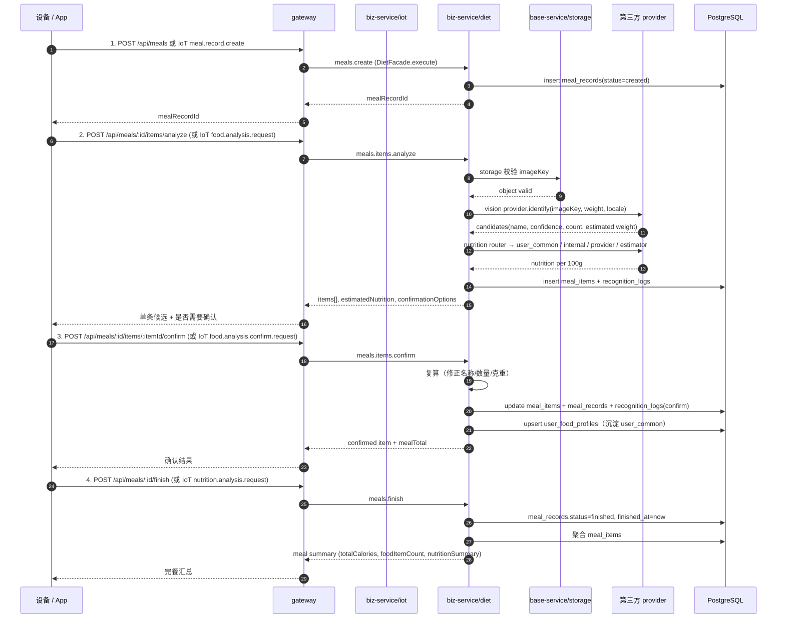

# 饮食中心模块规范

> 状态：**当前生效**（基线 v1.3）。
> 适用范围：`api/apps/biz-service/src/diet/` 内的所有代码，以及 `apps/gateway/src/modules/meals,foods` 对外路由层。
> 上位约束：[`项目架构总览与开发约束.md`](项目架构总览与开发约束.md)。
> 关联设备协议：[`设备协议模块规范.md`](设备协议模块规范.md) §7-§9（食物识别/确认/营养汇总）。
> 同步参考：
> - [`api/docs/分阶段路线图.md`](../api/docs/分阶段路线图.md) §2.3
> - [`api/docs/营养中心diet联调清单.md`](../api/docs/营养中心diet联调清单.md)
> - [`docs/diet-service-device-protocol-v1.0.md`](diet-service-device-protocol-v1.0.md)
> - [`api/docs/第三方食品库接入调研.md`](../api/docs/第三方食品库接入调研.md)
> - [`api/docs/第三方食品营养识别调研.md`](../api/docs/第三方食品营养识别调研.md)

---

## 1. 模块定位

饮食中心负责**从一张图 / 一次称重，到一份可信营养结果**的整条业务流，包括：

1. 餐次会话管理（`meal_record`）
2. 多模态食物识别（视觉 LLM + 营养库回查）
3. 用户确认 / 修正 → 沉淀
4. 餐次结束汇总（最终营养）
5. 食物建议 / 用户常吃 / 自建食物库

边界：

- **属于饮食中心**：餐次、识别、营养、food 知识库、provider 工厂、识别日志。
- **不属于饮食中心**：设备激活、设备状态、IoT topic 解析、上传凭证签发（属于 IoT / 设备 / 存储域）。
- 设备侧通过 IoT 协议进入饮食中心；App / Admin 通过 gateway HTTP 进入；两条入口必须在 facade 层归一。

---

## 2. 阶段一硬约束（不允许偏离）

来自 [`api/docs/分阶段路线图.md`](../api/docs/分阶段路线图.md) §2.3 / §7：

1. **北美 + 国内双部署**，单部署只服务一个区域；区域由 `DIET_DEPLOYMENT_REGION` 决定。
2. 视觉模型由 `LLM_VISION_PROVIDER` env 选择，可选 `openai / gemini / qwen`；区域偏好由部署侧决定。
3. **数量识别必做**：视觉端必须输出 `name + confidence + count`，缺省走用户在确认页补全。
4. 营养命中顺序：
   ```text
   user_common（用户沉淀；阶段一以 device_id 为逻辑 user 维度）
   → internal（自建食物库）
   → third_party provider（按 market × flow 选子集）
   → llm_estimated（兜底）
   ```
5. **国内** 第三方主力：薄荷健康 `boohee`；**北美** 主力：`usda_fdc` + `edamam`；`open_food_facts` 是全球免费条码补充；`nutritionix` 弱依赖，无 key 不阻塞。
6. 营养兜底模型多 provider，`LLM_NUTRITION_PROVIDER` 选其一（`openai / gemini / qwen`），不强绑单一厂商。
7. 单次 `food.analysis.request` 必须返回 **种类 + 数量（可为 null）+ 重量 + 预估营养**。
8. **本餐结束才做最终汇总**（`nutrition.analysis.request`），本期不做实时差值动画（Doc-MVP §S7）。
9. 用户沉淀维度：`user_common` 表的逻辑 user 现阶段就是 `device_id`；阶段二回填真实 `user_id`。
10. 会话标识统一为 `mealRecordId`，**不再并行** `mealSessionId` / `mealSession` 等别名。
11. 单位强制公制 `g`；UI 端 `g/oz` 切换只在端上完成。

---

## 3. 目录结构

```text
api/apps/biz-service/src/diet/
├── diet.module.ts                 # 模块装配（imports/providers/exports）
├── diet.facade.ts                 # 对外执行入口（execute / callAdmin / createMealRecord / analyzeFoodItem / confirmFoodItem / finishMealRecord）
├── diet.facade.grpc.controller.ts # gRPC 入口（gateway 调进来）
├── diet.facade.spec.ts
│
├── meal/                          # 餐次主链路（应用层）
│   ├── diet-application.service.ts  # 编排：建餐 / 识别 / 确认 / 完餐
│   ├── diet.service.ts              # 仓储/聚合（meal_records / meal_items）
│   └── diet.controller.ts           # 设备协议入口（被 IoT 调用）
│
├── food/                          # 食物身份 + 知识库 + 用户常吃
│   ├── food.service.ts
│   ├── food-identity.service.ts     # 名称归一化、别名、canonical
│   ├── food-knowledge.service.ts    # 自建知识库（internal source）
│   └── user-food-profile.service.ts # user_common（阶段一以 deviceId 为维度）
│
├── food-analysis/                 # 识别服务
│   ├── food-analysis.service.ts      # 视觉调用 + 候选生成
│   ├── food-analysis.service.spec.ts
│   ├── diet-image-storage.service.ts # 上传 tmp-file / 移动到正式路径
│   └── recognition-log.service.ts    # 写 recognition_logs（含 admin 查询）
│
├── nutrition/                     # 营养
│   ├── nutrition.service.ts                   # 主入口（含确认后复算）
│   ├── nutrition.service.spec.ts
│   ├── nutrition-calculator.ts                # 按 100g 基准换算
│   ├── nutrition-provider-router.service.ts   # market × flow → provider 列表
│   ├── nutrition-provider-router.service.spec.ts
│   └── nutrition-ranking.service.ts           # 候选排序与可信度
│
├── providers/                     # 第三方 provider 工厂
│   ├── provider-error.ts            # 通用 provider 错误
│   ├── provider-http.client.ts      # 共用 http 客户端 + spec
│   ├── nutrition-data-provider.factory.ts  # 营养库工厂 + spec
│   ├── boohee/                     # 国内薄荷健康
│   ├── usda-fdc/                   # 北美 USDA FoodData Central
│   ├── edamam/                     # 北美 Edamam
│   ├── nutritionix/                # 北美 Nutritionix（弱依赖）
│   ├── open-food-facts/            # 全球免费条码
│   ├── vision/                     # 视觉模型工厂
│   │   ├── vision-provider.factory.ts
│   │   ├── vision-image.ts
│   │   ├── openai-vision.provider.ts
│   │   ├── gemini-vision.provider.ts
│   │   └── qwen-vision.provider.ts
│   └── estimator/                  # 营养兜底 LLM
│       ├── nutrition-estimator.factory.ts
│       ├── openai-nutrition-estimator.provider.ts
│       ├── gemini-nutrition-estimator.provider.ts
│       └── qwen-nutrition-estimator.provider.ts
│
├── market/                        # 区域配置
│   └── diet-market.ts             # DietMarket 枚举 + 解析
│
└── interfaces/                    # 模块边界契约
    ├── diet-center.contracts.ts   # 餐/识别/营养/Provider plan
    └── provider.contracts.ts      # provider 接口签名
```

新增子文件必须遵守：

- **provider 不依赖 service**（单向）：`providers/* → interfaces/* → service/* → application/* → facade`。
- 跨服务调用只能通过 facade 或 application service，**禁止** 在 controller 内直接调 service 跨层；**禁止** 在 service 间互相引用形成环。
- 任何对外协议字段变更，必须先动 `interfaces/diet-center.contracts.ts` 与 `interfaces/provider.contracts.ts`，再改实现。

---

## 4. 数据模型

主表（详见 `api/data/db/migrations/20260503100000_init_platform_schema.sql`）：

| 表 | 关键字段 | 说明 |
| --- | --- | --- |
| `meal_records` | `id`、`tenant_id`、`user_id`、`device_id`、`locale`、`market`、`status`、`started_at`、`finished_at`、`total_calories`、`total_weight`、`creator_id`、`editor_id` | 餐次主表；`status: created | analyzing | active | finished` |
| `meal_items` | `id`、`meal_record_id`、`food_id?`、`name`、`canonical_name`、`weight_gram`、`measured_weight_gram`、`estimated_weight_gram`、`count`、`calories`、`protein/fat/carbs`、`source`、`provider`、`verified_level`、`confidence` | 单条识别项 |
| `foods` | `id`、`canonical_name`、`display_name`、`country_code`、`type`、`source` | 自建食物库 |
| `food_nutritions` | `food_id`、`provider`、`source`、`calories_per_100g`、`protein/fat/carbs_per_100g` | 营养来源映射 |
| `recognition_logs` | `id`、`meal_record_id`、`item_id?`、`image_key`、`weight_gram`、`request_id`、`provider`、`raw_response`、`status` | 识别审计与回放 |
| `user_food_profiles`（user_common） | `user_id`、`device_id`、`canonical_name`、`hit_count`、`last_seen_at` | 用户常吃 |

约束：

- **主键** 32 位小写 ULID（`generateId()`），`varchar(36)`。
- **时间字段** `timestamp(3) without time zone`，按 UTC 读写。
- `user_id` 在阶段一可空；阶段二回填时不允许 break 数据。
- 单餐 `meal_items.weight_gram` 等于 `measured_weight_gram` 或 `estimated_weight_gram`；汇总在 `meal_records.total_calories / total_weight`。
- 任何 schema 变更新增 migration 文件，禁止改已执行的 SQL。

---

## 5. 区域（Market）与语言（Locale）

- `DietMarket` 当前枚举：`CN` / `US`（`api/apps/biz-service/src/diet/market/diet-market.ts`）。
- **`market`**：决定 provider 选择、识别策略、营养数据源；优先级：
  1. 设备属性中的 `market`（管理后台创建设备时写入）
  2. 已建 `meal_record.market`
  3. 服务端默认 `DEFAULT_MARKET`
- **`locale`**：仅做国际化（食物展示名、错误文案、LLM prompt 语言）；不参与 provider 选择。
- 设备协议中**不接受**设备主动传 `market`（v1.3 拍板）。
- 服务端默认：`DEFAULT_LOCALE=en-US`，`DEFAULT_MARKET=US`。

---

## 6. 业务流程

### 6.1 主链路：建餐 → 识别 → 确认 → 完餐



### 6.2 识别路由（vision + nutrition）

视觉调用：

1. `VisionProviderFactory.resolveActive()` 按 `LLM_VISION_PROVIDER` 选 provider。
2. provider 接收 `imageKey + 称重 + locale`，返回候选列表（要求带 `count` 字段，缺省由设备/用户补）。
3. **软超时**：视觉超时不抛错，落到下一步营养兜底（`llm_estimated` 来源标注）。

营养路由（`NutritionProviderRouterService.resolvePlan`）：

按 `market × flow` 解析 plan，`flow` 顺序判定：

```text
hasBarcode → barcode
hasText / isRecipe → text
hasImage → image
else → food
```

当前 plan（截至本文件版本）：

| Market | Flow | sourceOrder | providerNames |
| --- | --- | --- | --- |
| CN | barcode | user_common → internal → cn_barcode → nutrition_label_ocr → llm_estimated | boohee |
| CN | text | user_common → internal → provider → llm_estimated | boohee, usda_fdc |
| CN | image | user_common → internal → provider → llm_estimated | boohee, usda_fdc |
| CN | food | user_common → internal → provider → llm_estimated | boohee, usda_fdc |
| US | barcode | user_common → internal → provider → nutrition_label_ocr → llm_estimated | edamam |
| US | text | user_common → internal → recipe → provider → llm_estimated | edamam, usda_fdc |
| US | image | user_common → internal → provider → llm_estimated | usda_fdc, edamam |
| US | food | user_common → internal → provider → llm_estimated | usda_fdc, edamam |

执行规则：

- 命中即返回（一旦得到可用营养，不再下探）。
- provider 全失败时降级为 `llm_estimated`，并在返回结构中明确 `source=llm_estimated`、`verifiedLevel=estimated`。
- 每个 provider 必须实现**软超时**（不抛错落到下一来源），失败日志统一写 `recognition_logs.raw_response` 字段。

### 6.3 用户确认与沉淀

确认时支持字段（与设备协议 v1.3 `food.analysis.confirm.request` 对齐）：

```ts
{
  mealRecordId,
  itemId,
  selectedFoodId?: string,
  selectedFoodName?: string,
  correctedName?: string,
  correctedCount?: number,
  correctedWeightGram?: number,
  confirmationSource: 'recognized' | 'user_common_selected'
                    | 'system_search_selected' | 'retry_recognition_selected',
}
```

服务端行为：

- 若有 `correctedWeightGram`，按修正后克重 × 100g 营养系数复算。
- 若 `selectedFoodId` 命中 `foods`，绑定 `meal_items.food_id`。
- 若名称是新值，新增 `foods + food_nutritions`（来源 `llm_estimated` 时 `verifiedLevel=estimated`）。
- 写 `user_food_profiles`（user_common）：以 `device_id` 为逻辑 user（阶段一），`hit_count += 1`。
- 写 `recognition_logs` 一条 `confirm` 事件。

### 6.4 完餐汇总

- 仅基于 `meal_items` 当前确认值汇总（不再走 LLM）。
- 返回 `totalCalories`、`foodItemCount`、`nutritionSummary{protein,fat,carbohydrate,fiber}`、`containsEstimated`、`finishedAt`。
- `meal_records.status = finished` 后再次调用 `analyze/confirm/finish` 必须返回 `409 conflict`（`error.key=resource.conflict`）。

---

## 7. 对外接口

### 7.1 C 端（gateway → diet facade.execute）

| Operation | HTTP | 描述 |
| --- | --- | --- |
| `meals.create` | `POST /api/meals` | 建餐 |
| `meals.items.analyze` | `POST /api/meals/:id/items/analyze` | 识别 |
| `meals.items.confirm` | `POST /api/meals/:id/items/:itemId/confirm` | 用户确认 |
| `meals.finish` | `POST /api/meals/:id/finish` | 完餐 |
| `meals.list` | `GET /api/meals` | 我的餐次列表 |
| `meals.get` | `GET /api/meals/:id` | 单餐详情 |
| `foods.suggest` | `GET /api/foods/suggest?q=&limit=` | 常吃 + 系统候选 |

gateway DTO 校验规则：

- `weightGram` 数值且 `>= 0.1`
- `locale` 形如 `zh-CN`、`en`
- `foodName` 必填，最大 128

### 7.2 B 端（gateway → diet facade.callAdmin）

`DietFacade.callAdmin` 支持的 service 域：`meals` / `foods` / `recognitionLogs`，每域内 method 由对应 service 暴露。**不允许**在 admin 入口绕过 facade 直接读写表。

### 7.3 设备协议入口（IoT → diet）

由 `apps/biz-service/src/diet/meal/diet.controller.ts` 接 IoT bridge 的 `event.req`：

| meta.event | facade method |
| --- | --- |
| `meal.record.create` | `createMealRecord` |
| `food.analysis.request` | `analyzeFoodItem` |
| `food.analysis.confirm.request` | `confirmFoodItem` |
| `nutrition.analysis.request` | `finishMealRecord` |

设备协议 payload 字段口径见《设备协议模块规范》§7-§9 与 [`docs/diet-service-device-protocol-v1.0.md`](diet-service-device-protocol-v1.0.md)。

### 7.4 响应字段对齐表（HTTP ↔ IoT）

下表给出 HTTP 与 IoT 两条入口的**关键字段必须同名**（避免设备和 App 端拿到的字段不一致）：

| HTTP body 字段 | IoT data 字段 | 说明 |
| --- | --- | --- |
| `mealRecordId` | `mealRecordId` | 唯一会话 ID |
| `itemId` | `foodItemId` | 单条识别项 ID（命名差异已被 v1.3 接受，**勿改**） |
| `items[]` | `items[]` | 候选列表 |
| `estimatedNutrition` | `estimatedNutrition` | 本次识别项聚合营养 |
| `requiresUserConfirmation` | `requiresUserConfirmation` | 是否需要确认 |
| `confirmationOptions` | `confirmationOptions` | 固定 4 个选项 |
| `userCommonCandidates` | `userCommonCandidates` | 用户常吃候选 |
| `nutritionSummary` | `nutritionSummary` | 完餐汇总 |

---

## 8. Provider 接入规范

### 8.1 视觉 Provider（vision）

接口（见 `interfaces/provider.contracts.ts`）：

```ts
interface FoodVisionProvider {
  identify(input: VisionIdentifyInput): Promise<VisionIdentifyResult>;
}
```

要求：

- **必须输出** `name + confidence + count`（缺省 count = null）。
- 输出 candidate 类型必须落到 `RecognitionCandidate.type` 的 6 个枚举里（`ingredient / prepared_dish / packaged_food / restaurant_food / mixed_meal / unknown`）。
- prompt 文件统一放 `providers/vision/<provider>/prompts/`，按 locale 切换文案。
- **软超时**：默认 12s（按 provider 自配），超时返回空候选，由营养层兜底。
- 注册：在 `VisionProviderFactory.registry` 加一项，在 `DietModule.providers` 加 NestJS provider，**禁止**直接 `new XxxProvider()`。

### 8.2 营养库 Provider（nutrition-data）

接口：

```ts
interface NutritionDataProvider {
  search(input: NutritionSearchInput): Promise<NutritionCandidate[]>;
  enabled?(): boolean;
}
```

要求：

- 返回 `NutritionCandidate` 必填 `caloriesPer100g / proteinPer100g / fatPer100g / carbsPer100g`（标准化 100g 基线，由 calculator 换算）。
- **不要在 provider 内做营养换算**（calculator 负责）。
- 鉴权与重试在 `provider-http.client.ts` 内统一处理（含指数退避 + 软超时 + 错误归一化）。
- 注册：见 `NutritionDataProviderFactory.registry`。

新增国内/区域营养库（如 boohee、cn_internal）必须同时：

1. 在 factory 注册名。
2. 在 `NutritionProviderRouterService.MARKET_ROUTE_PLANS` 配置 plan。
3. 更新本文件 §6.2 路由表。

### 8.3 营养兜底 LLM（estimator）

接口：

```ts
interface NutritionEstimatorProvider {
  estimate(input: NutritionEstimateInput): Promise<NutritionCandidate>;
}
```

要求：

- 当 user_common / internal / 第三方 provider 全部 miss 时调用。
- 返回结果必须标记 `source=llm_estimated`，`verifiedLevel=estimated`。
- 错误必须返回 `provider-error.ts` 中的标准错误，不抛 NestJS 异常。

---

## 9. 环境变量

| Env | 默认 | 说明 |
| --- | --- | --- |
| `DIET_DEPLOYMENT_REGION` | - | 部署区域，影响默认 market |
| `DEFAULT_LOCALE` | `en-US` | 默认返回语言 |
| `DEFAULT_MARKET` | `US` | 默认业务市场 |
| `LLM_VISION_PROVIDER` | `openai` | 视觉模型：`openai \| gemini \| qwen` |
| `LLM_NUTRITION_PROVIDER` | `openai` | 营养兜底：`openai \| gemini \| qwen` |
| `NUTRITION_DATA_PROVIDERS` | `nutritionix,boohee,usda_fdc,edamam` | 启动期注册顺序（filter 后真正使用由 router 决定） |
| `NUTRITIONIX_APP_ID / NUTRITIONIX_API_KEY` | - | 缺则自动禁用（不阻塞启动） |
| `BOOHEE_*` | - | 国内薄荷健康 |
| `USDA_FDC_API_KEY` | - | USDA FoodData Central |
| `EDAMAM_APP_ID / EDAMAM_APP_KEY` | - | Edamam |
| `OPEN_FOOD_FACTS_*` | - | 一般无需鉴权 |
| `OPENAI_API_KEY / GEMINI_API_KEY / QWEN_API_KEY` | - | LLM provider 凭据 |
| `DIET_VISION_TIMEOUT_MS` | 12000 | 视觉软超时 |
| `DIET_NUTRITION_TIMEOUT_MS` | 8000 | 营养软超时 |

env 加载约束：详见总览 §9。**严禁** 在 service 代码里 `process.env.X`，必须 `@lumimax/config`。

---

## 10. 错误码

| code | error.key | HTTP | 触发 |
| --- | --- | --- | --- |
| 0 | ok | 200 | 成功 |
| 40003 | request.invalid_params | 400 | weightGram 非法、locale 错误等 |
| 40004 | request.validation_failed | 400 | DTO 校验失败 |
| 40400 | resource.not_found | 404 | mealRecordId / itemId 不存在 |
| 40901 | resource.conflict | 409 | 餐次已 finished 继续 analyze/confirm |
| 42201 | request.unprocessable | 422 | imageKey 不属于上传 token / weight 超过上限 |
| 50301 | upstream.unavailable | 503 | 视觉 + 营养 + 兜底全部失败 |
| 50401 | upstream.timeout | 504 | 强超时（极端，软超时已兜底） |

设备协议侧错误码补丁（[`docs/diet-service-device-protocol-v1.0.md`](diet-service-device-protocol-v1.0.md) §11）：

| code | msg |
| --- | --- |
| 40001 | invalid payload |
| 40400 | meal record not found |
| 40900 | meal record already finished |
| 42200 | object key invalid |
| 50000 | internal error |
| 50300 | analysis unavailable |

设备协议错误**只**走 `data.code / data.msg`，不要伪装成 HTTP 状态。

---

## 11. RabbitMQ 事件

来自 [`api/docs/RabbitMQ消息规范.md`](../api/docs/RabbitMQ消息规范.md)：

| Routing key | 生产者 | 消费者 |
| --- | --- | --- |
| `iot.meal.record.create.v1` | IoT bridge | diet meal 应用 |
| `iot.food.analysis.request.v1` | IoT bridge | diet food-analysis |
| `iot.food.analysis.confirm.request.v1` | IoT bridge | diet meal 应用 |
| `iot.nutrition.analysis.request.v1` | IoT bridge | diet meal 应用 |

队列：`q.biz.diet.meal.create` / `q.biz.diet.food.analyze` / `q.biz.diet.food.confirm` / `q.biz.diet.meal.finish` 及对应 `.dlq`。

消费侧硬约束：

- 消费必须**幂等**（按 `meta.requestId` + `event` + `deviceId` 去重，TTL ≥ 24h）。
- 失败重试最多 3 次（1s / 5s / 30s），超出进 DLQ。
- DLQ 必须保留最后错误的 rootCause + stack 摘要。

---

## 12. 测试与验收

### 12.1 单元/集成测试落点

- `diet.facade.spec.ts`
- `food-analysis/food-analysis.service.spec.ts`：vision miss → user_common miss → 3rd hit
- `nutrition/nutrition.service.spec.ts`
- `nutrition/nutrition-provider-router.service.spec.ts`：market × flow plan
- `providers/provider-http.client.spec.ts`：超时与重试
- `providers/nutrition-data-provider.factory.spec.ts`：注册与按 env 启停

### 12.2 e2e（gateway → biz）

至少覆盖：

1. `POST /api/meals` → 200 + mealRecordId
2. `POST /api/meals/:id/items/analyze` 含 `imageKey + weightGram` → 200 + items[]
3. `POST /api/meals/:id/items/:itemId/confirm` 修正名称 → 200 + 复算结果
4. `POST /api/meals/:id/finish` → 200 + 汇总
5. 异常：mealRecordId 不存在 → 404 / 餐次 finished 再 analyze → 409 / imageKey 非法 → 422

### 12.3 MVP 验收

详见 [`api/docs/MVP验收标准.md`](../api/docs/MVP验收标准.md) §4.3 / §4.4 / §4.5。**回归不可破坏**：

- 设备协议 v1.3 `food.analysis.result.items[]`、`requiresUserConfirmation`、`confirmationOptions` 字段顺序与命名。
- gateway 路径（HTTP 路由保持兼容）。

---

## 13. 开发者 checklist（PR 前自检）

提 PR 前必须能逐条勾上：

- [ ] **未** 在 `apps/gateway/` 写业务逻辑（只做 DTO + 转发）
- [ ] **未** 在 controller 内直接调用第三方 / 直接 SQL
- [ ] **未** 在 service 里 `process.env.X`（必须 `getEnvString` 等 `@lumimax/config`）
- [ ] **未** 引入新 provider 而不更新 `DietModule.providers` 与 `interfaces/provider.contracts.ts`
- [ ] **未** 引入字段 break 设备协议 v1.3 / HTTP 路由
- [ ] 修改 SQL 表 → 新增 migration 文件（不改已执行的）
- [ ] 修改 facade 入参/出参 → 同步 `interfaces/diet-center.contracts.ts`
- [ ] 修改 RabbitMQ envelope → 在 `RabbitMQ消息规范.md` 与本文件 §11 同步登记
- [ ] 新增/修改第三方 provider → 更新本文件 §6.2 / §9 表格
- [ ] 单测覆盖：至少一条「主链路 happy path」+ 一条「provider miss 兜底」
- [ ] 日志：错误日志必须带 `requestId / deviceId / mealRecordId / provider / rootCause`
- [ ] 多语言：新增错误码补 `api/i18n/errors/{zh-CN,en-US,ko-KR}.json`

---

## 14. 不做清单（饮食域）

```text
× 在 gateway 直接调用 OpenAI / Gemini / Qwen / Edamam / USDA
× 客户端 / 设备直接命中第三方营养库（必须经过 router）
× 把 vision 和 nutrition 写在同一个 service（必须分 service + factory）
× 实时差值动画（Doc-MVP §S7 本期不做）
× 单餐多营养库结果直接拼接展示（必须由 ranking 选 1 个主结果 + 候选）
× 改 v1.3 设备协议字段名（要改先升 v1.4 + 文档评审）
× 引入新 LLM 厂商而不注册到 `LLM_*_PROVIDER` 枚举
```

---

## 15. 变更登记

| 日期 | 版本 | 变更 |
| --- | --- | --- |
| 2026-05-12 | v1.0 | 基于设备协议 v1.3 + 分阶段路线图初稿，整理饮食中心硬约束 |
